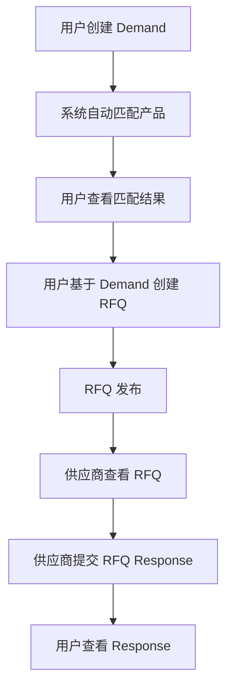
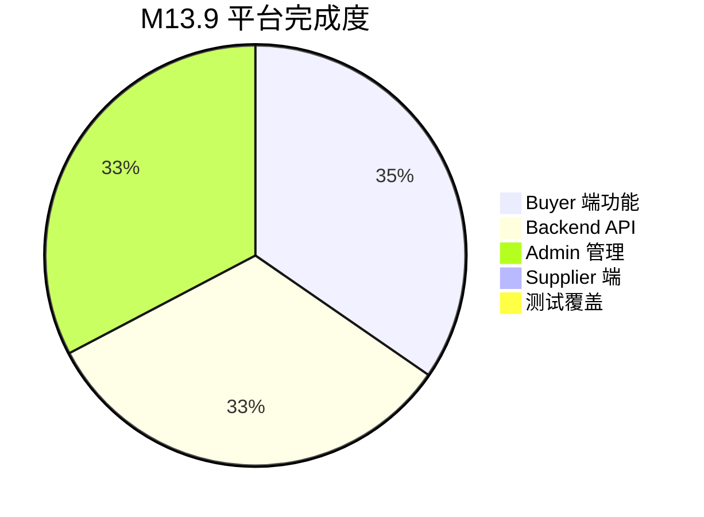

# VISNDT 平台当前能力说明 V1.0

**版本**: V1.0  
**日期**: 2026-08-04  
**阶段**: M13.9 Web MVP Freeze  
**适用范围**: 客户、合作伙伴、投资合作沟通  

---

## 1. 项目简介

### VISNDT 是什么？

**VISNDT**（Visual Inspection & Non-Destructive Testing）是一个**工业检测设备信息与需求撮合平台**。

平台聚焦工业无损检测（NDT）和工业视觉检测领域，为设备采购方（Buyer）提供精准的产品信息查询、技术参数对比和需求匹配服务，同时为设备制造商/供应商（Supplier）提供产品展示和客户获取渠道。

### 核心价值主张

| 角色 | 核心价值 |
|------|---------|
| **采购工程师** | 一站式查询工业检测设备，精准匹配需求，快速发起询价 |
| **设备制造商** | 产品展示平台，获取精准客户，降低销售成本 |
| **行业服务商** | 技术参数标准化，行业数据沉淀 |

---

## 2. 平台定位

VISNDT 定位为垂直行业平台，专注于工业检测设备领域，提供以下四大核心能力：

### 2.1 工业检测设备数据库

```
  ┌─────────────────────────────────────────────────┐
  │           工业检测设备数据库                       │
  ├─────────────────────────────────────────────────┤
  │                                                  │
  │  • 产品分类体系 (多级分类)                        │
  │  • 标准化参数体系 (尺寸/精度/材质/性能)           │
  │  • 制造商信息                                   │
  │  • 技术文档与认证                                │
  │  • 产品图片与媒体                                │
  │                                                  │
  └─────────────────────────────────────────────────┘
```

### 2.2 产品展示平台

- 产品搜索与筛选（关键词、分类、排序）
- 产品详情页（技术参数、制造商、询价入口）
- 分类浏览（按行业标准分类）

### 2.3 技术资料平台

- 技术参数体系（标准化参数定义）
- 认证信息展示
- 技术文档查阅

### 2.4 采购需求匹配平台

- 采购需求发布
- 智能产品匹配
- 询价请求（RFQ）管理
- 供应商响应管理

---

## 3. 当前平台能力

### 3.1 产品中心

| 能力 | 状态 | 说明 |
|------|------|------|
| 工业检测设备分类 | ✅ 已实现 | 多级分类体系，支持父子分类 |
| 产品参数体系 | ✅ 已实现 | 参数组 → 参数定义 → 参数选项 → 参数值，完整四层体系 |
| 产品详情展示 | ✅ 已实现 | 技术参数、制造商信息、产品图片、文档下载 |
| 产品搜索 | ✅ 已实现 | 关键词搜索 + 分类筛选 + 排序 |
| 产品列表分页 | ✅ 已实现 | 每页 12 个产品 |
| 分类浏览 | ✅ 已实现 | 分类卡片 + 子分类展开 |

**产品参数体系说明：**

平台建立了标准化的参数体系，支持以下参数类型：
- **STRING** — 文本参数（如：品牌、材质）
- **NUMBER** — 数值参数（如：直径、精度、温度范围）
- **BOOLEAN** — 布尔参数（如：是否防水）
- **ENUM** — 枚举参数（如：光源类型、视向）

### 3.2 需求中心

| 能力 | 状态 | 说明 |
|------|------|------|
| 用户发布检测需求 | ✅ 已实现 | 填写需求标题、描述、预算、数量、期望交付日期 |
| 需求参数化 | ✅ 已实现 | 基于参数体系设置需求参数范围 |
| Demand 管理 | ✅ 已实现 | 需求列表、详情、状态管理 |
| 需求状态流转 | ✅ 已实现 | DRAFT → PUBLISHED → PROCESSING → CLOSED |

### 3.3 智能匹配基础

| 能力 | 状态 | 说明 |
|------|------|------|
| 产品/需求匹配 | ✅ 已实现 | 基于参数匹配的产品推荐引擎 |
| 匹配评分 | ✅ 已实现 | 数值化匹配分数，支持排序 |
| 匹配状态管理 | ✅ 已实现 | PENDING → MATCHED → REVIEWED → ACCEPTED/REJECTED |

**当前匹配算法能力：**
- 基于需求参数（参数定义 + 值范围）与产品参数值进行匹配
- 输出匹配分数（0-100 分）
- 支持参数优先级权重
- 匹配结果状态可追溯

### 3.4 RFQ 询价体系

| 能力 | 状态 | 说明 |
|------|------|------|
| 用户询价流程 | ✅ 已实现 | 从 Demand 创建 RFQ |
| RFQ 管理 | ✅ 已实现 | RFQ 列表、详情、状态管理 |
| RFQ 状态流转 | ✅ 已实现 | DRAFT → OPEN → RESPONDING → CLOSED |
| RFQ 响应管理 | ✅ 已实现 | 供应商响应查看 |

**RFQ 业务流程：**



### 3.5 用户工作台

| 能力 | 状态 | 说明 |
|------|------|------|
| 仪表盘 (Dashboard) | ✅ 已实现 | 欢迎信息 + 统计卡片 + 快捷操作 |
| 工作台 (Workspace) | ✅ 已实现 | 侧边栏导航 + 数据总览 |
| 需求管理 | ✅ 已实现 | 新建、列表、详情 |
| RFQ 管理 | ✅ 已实现 | 新建、列表、详情 |
| 匹配查看 | ✅ 已实现 | 聚合匹配列表 |
| 账户设置 | ✅ 已实现 | 个人信息 + 退出登录 |

### 3.6 管理后台

| 能力 | 状态 | 说明 |
|------|------|------|
| 用户管理 | ✅ 已实现 | 用户 CRUD |
| 组织管理 | ✅ 已实现 | 组织 CRUD |
| 产品管理 | ✅ 已实现 | 产品 CRUD + 分类 + 参数 |
| 需求管理 | ✅ 已实现 | 需求查看 |
| RFQ 管理 | ✅ 已实现 | RFQ 查看 + 创建 |
| 询价管理 | ✅ 已实现 | 询价查看 |
| 匹配监控 | ✅ 已实现 | 匹配结果查看 |
| 审计日志 | ✅ 已实现 | 操作记录查询 |
| 通知管理 | ✅ 已实现 | 通知查看 |

---

## 4. 技术架构

### 4.1 整体架构

```
┌──────────────────────────────────────────────────────────────────┐
│                      VISNDT 技术架构                              │
├──────────────────────────────────────────────────────────────────┤
│                                                                   │
│   ┌──────────────┐   ┌──────────────┐   ┌──────────────┐         │
│   │  Buyer Web   │   │  Admin Panel │   │  External     │         │
│   │  Next.js 15  │   │  React 19    │   │  API Clients  │         │
│   │  Tailwind CSS│   │  Ant Design  │   │               │         │
│   └──────┬───────┘   └──────┬───────┘   └──────┬────────┘         │
│          │                  │                   │                  │
│          └──────────────────┼───────────────────┘                  │
│                             │                                      │
│                             ▼                                      │
│   ┌──────────────────────────────────────────────────────┐        │
│   │              NestJS 11 API Server                    │        │
│   │  ┌─────┐ ┌──────┐ ┌────────┐ ┌───────┐ ┌────────┐  │        │
│   │  │Auth │ │Product│ │Demand  │ │  RFQ  │ │Admin   │  │        │
│   │  │JWT  │ │CRUD   │ │Matching│ │Response│ │Panel   │  │        │
│   │  └─────┘ └──────┘ └────────┘ └───────┘ └────────┘  │        │
│   │                                                     │        │
│   │  Security: Helmet + Throttler + CSRF + Bcrypt       │        │
│   │  Docs: Swagger (OpenAPI)                            │        │
│   └──────────────────────┬───────────────────────────────┘        │
│                          │                                         │
│             ┌────────────┼────────────┐                           │
│             ▼            ▼            ▼                           │
│   ┌──────────────┐ ┌──────────┐ ┌──────────────┐                  │
│   │  PostgreSQL  │ │  S3      │ │  Prisma ORM  │                  │
│   │  (Primary)   │ │  (Files) │ │  (Type-safe) │                  │
│   └──────────────┘ └──────────┘ └──────────────┘                  │
│                                                                   │
└──────────────────────────────────────────────────────────────────┘
```

### 4.2 Frontend

| 组件 | 技术 | 说明 |
|------|------|------|
| Web 框架 | Next.js 15.5.20 (App Router) | 服务端渲染 + 静态生成 |
| UI 库 | React 19 + Tailwind CSS 4 | 响应式设计 |
| 数据获取 | TanStack React Query 5.101 | 缓存 + 自动刷新 |
| 认证 | HttpOnly Cookie JWT + CSRF | 安全认证 |

### 4.3 Backend

| 组件 | 技术 | 说明 |
|------|------|------|
| 框架 | NestJS 11 | 企业级 Node.js 框架 |
| 语言 | TypeScript 5.7 (strict) | 类型安全 |
| ORM | Prisma 7.8 | 类型安全数据库操作 |
| 认证 | JWT + Passport + RefreshToken | 多策略认证 |
| 文档 | Swagger (OpenAPI) | 自动生成 API 文档 |

### 4.4 Database

| 组件 | 技术 | 说明 |
|------|------|------|
| 数据库 | PostgreSQL | 关系型数据库 |
| 数据模型 | 23 个模型 | 覆盖核心业务实体 |
| 迁移 | 16 次迁移 | 版本化数据库变更 |

### 4.5 Security

| 维度 | 实现 |
|------|------|
| 认证 | JWT (HttpOnly Cookie) + RefreshToken 轮换 |
| CSRF | Double Submit Cookie 模式 |
| 密码 | Bcrypt 哈希 |
| 速率限制 | @nestjs/throttler |
| 安全头 | Helmet |
| CORS | 配置化可信源 |

---

## 5. 当前版本状态

| 维度 | 状态 |
|------|------|
| 版本号 | M13.9 Web MVP Freeze |
| Web 路由 | 20 个 (17 静态 + 3 动态) |
| API 端点 | ~88 个 |
| 数据模型 | 23 个 |
| Admin 页面 | 44 个 |
| 构建状态 | ✅ 通过 (Exit Code 0) |
| 代码质量 | 0 `any` 类型, 0 `console.log` |

### 平台完成度



### 下一步

平台将在 M14 阶段启动 Supplier 端开发，完善 RFQ 业务闭环，建立测试体系。

---

**文档版本**: V1.0 | **生成日期**: 2026-08-04 | **机密级别**: 内部