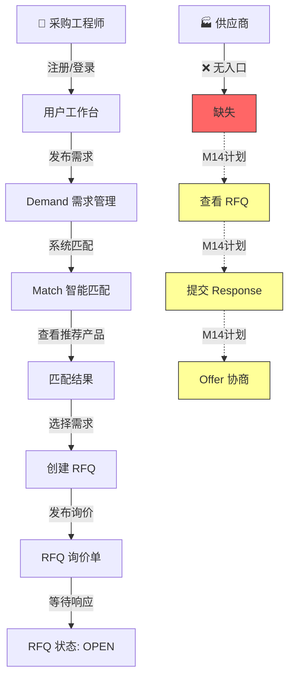
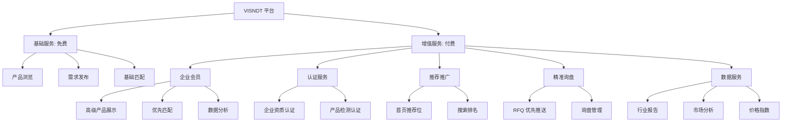

# VISNDT 商业闭环分析

**版本**: V1.0  
**日期**: 2026-08-04  
**阶段**: M13.9 Freeze  
**定位**: 产品决策与商业方向分析  

---

## 1. 当前技术闭环

### 1.1 已实现流程



### 1.2 闭环状态

| 环节 | 状态 | 说明 |
|------|------|------|
| 用户注册 → 登录 | ✅ 完整 | JWT Cookie 认证 |
| 浏览产品 → 产品详情 | ✅ 完整 | 搜索 + 筛选 + 分页 |
| 产品详情 → 询价 | ✅ 完整 | Inquiry 表单 |
| 发布需求 | ✅ 完整 | Demand 参数化 |
| 系统匹配 | ✅ 完整 | 自动匹配引擎 |
| 查看匹配 | ✅ 完整 | Match 列表 |
| 创建 RFQ | ✅ 完整 | 从 Demand 创建 |
| 供应商响应 RFQ | ❌ 缺失 | M14 计划 |
| Offer 协商 | ❌ 缺失 | M14 计划 |
| 交易推进 | ❌ 缺失 | M15+ 计划 |

---

## 2. 当前商业闭环缺口

### 2.1 核心缺口

```
┌─────────────────────────────────────────────────────────────┐
│                  当前商业闭环缺口分析                          │
├─────────────────────────────────────────────────────────────┤
│                                                              │
│  Buyer 侧:  ✅ 完整                                          │
│  ┌──────────────────────────────────────────────────┐        │
│  │ 浏览 → 需求 → 匹配 → RFQ                          │        │
│  └──────────────────────────────────────────────────┘        │
│                                                              │
│  Supplier 侧: ❌ 完全缺失                                   │
│  ┌──────────────────────────────────────────────────┐        │
│  │ 注册 → 产品管理 → 报价 → RFQ响应 → 客户管理       │        │
│  └──────────────────────────────────────────────────┘        │
│                                                              │
│  平台撮合: ❌ 断裂                                           │
│  ┌──────────────────────────────────────────────────┐        │
│  │ Buyer RFQ ───X─── Supplier Response               │        │
│  └──────────────────────────────────────────────────┘        │
│                                                              │
└─────────────────────────────────────────────────────────────┘
```

### 2.2 影响评估

| 缺失 | 商业影响 | 严重度 |
|------|---------|--------|
| 无 Supplier 端 | 平台只有买方，没有供应方，无法形成交易 | 🔴 致命 |
| 无 RFQ 响应 | RFQ 发出后石沉大海，买方体验差 | 🔴 致命 |
| 无 Offer 管理 | 供应商无法报价，招标流程不完整 | 🟡 严重 |
| 无交易闭环 | 平台价值停留在信息展示，无法变现 | 🟡 严重 |

---

## 3. 买家侧分析

### 3.1 为什么不用搜索引擎？

| 搜索引擎的局限 | VISNDT 的价值 |
|---------------|---------------|
| 搜索结果泛化，包含大量无关内容 | 垂直行业数据，精准匹配 |
| 产品参数无法直接对比 | 标准化参数体系，一键对比 |
| 需要访问多个厂商网站 | 统一平台，一站式浏览 |
| 无法评估厂商可靠性 | 厂商认证 + 平台背书 |
| 搜索效率低，耗时耗力 | 智能匹配，系统推荐 |

### 3.2 为什么进入 VISNDT？

**价值主张金字塔：**

```
        ┌──────────────┐
        │  交易安全     │  ← 平台担保，降低采购风险
        │  专业服务     │
        ├──────────────┤
        │  智能匹配     │  ← 系统推荐，省时省力
        │  精准推荐     │
        ├──────────────┤
        │  技术参数     │  ← 标准化参数，精准对比
        │  专业筛选     │
        ├──────────────┤
        │  产品信息     │  ← 一站式查询，信息完整
        │  分类浏览     │
        └──────────────┘
```

**核心优势：**

| 优势 | 说明 |
|------|------|
| **精准设备匹配** | 基于技术参数（尺寸、精度、材质等）自动匹配，而非关键词模糊搜索 |
| **技术参数筛选** | 标准化参数体系，支持数值范围筛选、枚举筛选，精准定位 |
| **专业供应链** | 汇聚行业制造商，厂商资质可查，产品信息完整 |
| **询价高效** | 一键发起 RFQ，供应商集中响应，缩短采购周期 |
| **决策支持** | 匹配评分、参数对比、制造商信息，辅助采购决策 |

---

## 4. 供应商侧分析

### 4.1 为什么加入 VISNDT？

| 传统销售模式痛点 | VISNDT 解决方案 |
|-----------------|----------------|
| 销售团队成本高 | 线上展示，降低获客成本 |
| 客户获取渠道有限 | 平台引流，精准客户主动上门 |
| 产品信息传播慢 | 标准化展示，一键触达 |
| 竞品信息不透明 | 平台环境，了解市场动态 |
| 客户信任建立难 | 平台认证，增强信任 |

### 4.2 为什么上传产品？

| 动机 | 收益 |
|------|------|
| **产品曝光** | 被采购方搜索到 → 增加商机 |
| **技术参数展示** | 标准化参数 → 专业形象 → 提升信任 |
| **认证资质展示** | 证书/报告 → 增强竞争力 |
| **案例展示** | 应用案例 → 证明实力 |
| **数据沉淀** | 产品数据 → 长期资产 |

### 4.3 为什么回复 RFQ？

| 动机 | 收益 |
|------|------|
| **精准客户** | RFQ 带着明确采购需求，转化率高 |
| **降低销售成本** | 不需要陌生拜访，客户主动发起 |
| **获取询盘** | 每一条 RFQ 都是一个潜在订单 |
| **竞争情报** | 了解市场需求和竞品动态 |
| **建立客户关系** | 持续互动，长期合作 |

---

## 5. 平台侧分析

### 5.1 商业模式可能路径



### 5.2 收入模式分析

| 模式 | 阶段 | 目标客户 | 预期收入 |
|------|------|---------|---------|
| **企业会员** | M14-M15 | 设备制造商 | 年费制 |
| **认证服务** | M15+ | 制造商 + 检测机构 | 按次收费 |
| **推荐推广** | M15+ | 制造商 | 竞价/固定 |
| **精准询盘** | M15+ | 制造商 | 按条/套餐 |
| **数据服务** | M16+ | 行业机构 | 订阅制/按次 |

### 5.3 平台价值公式

```
平台价值 = 买方数量 × 供应商数量 × 交易成功率 × 客单价

当前阶段:
  买方数量: 待验证
  供应商数量: 0 (待 M14 启动)
  交易成功率: 待验证
  客单价: 高 (工业设备)

M14 目标:
  ✅ 供应商入驻 (基础)
  ✅ RFQ 闭环 (买方→供应商→响应)
  ✅ 平台撮合价值验证
```

---

## 6. M14 商业方向建议

### 6.1 优先级

| 优先级 | 方向 | 理由 |
|--------|------|------|
| **P0** | 供应商体系建立 | 当前最大缺口，M14 必须完成 |
| **P0** | RFQ 业务闭环 | 验证平台撮合价值 |
| **P1** | 产品数据丰富 | 提升平台信息价值 |
| **P1** | 用户体验优化 | 提升留存和转化 |
| **P2** | 商业模式探索 | 收入模式验证 |
| **P2** | 数据分析 | 辅助决策 |

### 6.2 M14 商业目标

| 目标 | KPI | 验证方式 |
|------|-----|---------|
| 供应商入驻 | 10+ 家 | 管理员后台确认 |
| 产品上架 | 50+ 个 | 产品列表页 |
| RFQ 撮合 | 完成 5+ 次完整 RFQ 流程 | 系统日志 |
| 平台价值验证 | 供应商反馈正向 | 用户访谈 |

### 6.3 暂缓功能

| 功能 | 暂缓原因 | 计划 |
|------|---------|------|
| 在线支付 | 需要支付网关、合规 | M16+ |
| 即时通讯 | 复杂度高、当前可替代 | M16+ |
| AI 推荐 | 需要数据积累 | M17+ |
| 商城 | 需要完整交易体系 | M17+ |
| 移动 App | Web 优先 | M16+ |

---

**文档版本**: V1.0 | **生成日期**: 2026-08-04 | **机密级别**: 内部