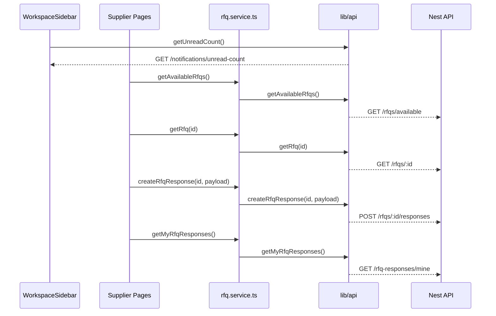

# 316_M14.1.4_Supplier_Workspace_Stabilization_Audit_Report

**日期**: 2026-08-09  
**任务编号**: M14.1.4 Supplier Workspace Stabilization Audit  
**执行方式**: 只读审计 / 不修改业务代码 / 先报告后处理

---

## 1. 执行前确认

- 仓库根目录：`F:\Desktop\VISNDT`
- 代码根目录：`F:\Desktop\VISNDT\VISNDT`
- 当前分支：`main`
- 本次任务性质：**仅执行审计**

已读取前置报告：

1. [311_M14.1.2.3_Supplier_Workspace_Data_Integration_Report.md](file:///F:/Desktop/VISNDT/docs/_review/311_M14.1.2.3_Supplier_Workspace_Data_Integration_Report.md)
2. [312_M14.1.3.1_Supplier_RFQ_Detail_Foundation_Report.md](file:///F:/Desktop/VISNDT/docs/_review/312_M14.1.3.1_Supplier_RFQ_Detail_Foundation_Report.md)
3. [315_M14.1.3.4_Supplier_RFQ_Response_Create_Frontend_Report.md](file:///F:/Desktop/VISNDT/docs/_review/315_M14.1.3.4_Supplier_RFQ_Response_Create_Frontend_Report.md)

本次审计检查项：

1. Supplier Workspace 路由完整性
2. 页面调用链
3. API 消费矩阵
4. UI 状态一致性
5. Freeze 检查
6. 是否存在明显阻塞问题

本次只读审计重点核查文件：

- [apps/web/src/app/workspace/supplier/page.tsx](file:///F:/Desktop/VISNDT/VISNDT/apps/web/src/app/workspace/supplier/page.tsx)
- [apps/web/src/app/workspace/supplier/rfqs/page.tsx](file:///F:/Desktop/VISNDT/VISNDT/apps/web/src/app/workspace/supplier/rfqs/page.tsx)
- [apps/web/src/app/workspace/supplier/rfqs/[id]/page.tsx](file:///F:/Desktop/VISNDT/VISNDT/apps/web/src/app/workspace/supplier/rfqs/%5Bid%5D/page.tsx)
- [apps/web/src/app/workspace/supplier/responses/page.tsx](file:///F:/Desktop/VISNDT/VISNDT/apps/web/src/app/workspace/supplier/responses/page.tsx)
- [apps/web/src/components/workspace/WorkspaceSidebar.tsx](file:///F:/Desktop/VISNDT/VISNDT/apps/web/src/components/workspace/WorkspaceSidebar.tsx)
- [apps/web/src/components/rfq/RFQStatusBadge.tsx](file:///F:/Desktop/VISNDT/VISNDT/apps/web/src/components/rfq/RFQStatusBadge.tsx)
- [apps/web/src/services/rfq.service.ts](file:///F:/Desktop/VISNDT/VISNDT/apps/web/src/services/rfq.service.ts)
- [apps/web/src/lib/api/rfqs.ts](file:///F:/Desktop/VISNDT/VISNDT/apps/web/src/lib/api/rfqs.ts)
- [apps/web/src/lib/api/notifications.ts](file:///F:/Desktop/VISNDT/VISNDT/apps/web/src/lib/api/notifications.ts)
- [apps/api/src/rfq-responses/rfq-responses.controller.ts](file:///F:/Desktop/VISNDT/VISNDT/apps/api/src/rfq-responses/rfq-responses.controller.ts)
- [apps/api/src/rfq-responses/rfq-responses.service.ts](file:///F:/Desktop/VISNDT/VISNDT/apps/api/src/rfq-responses/rfq-responses.service.ts)
- [database/prisma/schema.prisma](file:///F:/Desktop/VISNDT/VISNDT/database/prisma/schema.prisma)

---

## 2. 审计意图

**Intent:** 验证当前 Supplier Workspace 是否已经形成可达、可用、边界清晰的基础工作流，并识别会阻塞阶段验收的明显问题。

---

## 3. 可视化概览

**业务流概览**

```mermaid
flowchart LR
    A[Supplier 侧边栏] --> B[/workspace/supplier/rfqs 列表页]
    A --> C[/workspace/supplier/responses 我的响应页]
    B -.缺少正向入口.-> D[/workspace/supplier/rfqs/[id] 详情页]
    D --> E[响应提交表单]
    style A fill:#bbdefb,color:#0d47a1
    style B fill:#c8e6c9,color:#1a5e20
    style C fill:#c8e6c9,color:#1a5e20
    style D fill:#fff3e0,color:#e65100
    style E fill:#fff3e0,color:#e65100
```

**技术调用链概览**



---

## 4. 路由完整性检查

### 4.1 当前已存在路由

| 路由 | 页面状态 | 入口来源 | 审计结论 |
|---|---|---|---|
| `/workspace/supplier` | 已实现 | Supplier 侧边栏 | 可达 |
| `/workspace/supplier/rfqs` | 已实现 | Supplier 侧边栏 | 可达 |
| `/workspace/supplier/rfqs/[id]` | 已实现 | 未发现现有 UI 正向入口 | **不可从现有 UI 到达** |
| `/workspace/supplier/responses` | 已实现 | Supplier 侧边栏 | 可达 |

### 4.2 路由证据

- Supplier 侧边栏当前仅配置 `/workspace/supplier`、`/workspace/supplier/rfqs`、`/workspace/supplier/responses`：[WorkspaceSidebar.tsx:L26-L32](file:///F:/Desktop/VISNDT/VISNDT/apps/web/src/components/workspace/WorkspaceSidebar.tsx#L26-L32)
- RFQ 列表页对每条数据只渲染静态卡片，没有 `Link`、`href` 或 `router.push` 跳详情：[rfqs/page.tsx:L92-L125](file:///F:/Desktop/VISNDT/VISNDT/apps/web/src/app/workspace/supplier/rfqs/page.tsx#L92-L125)
- 详情页本身已存在，且仅提供“返回供应商询价列表”：[[id]/page.tsx:L161-L167](file:///F:/Desktop/VISNDT/VISNDT/apps/web/src/app/workspace/supplier/rfqs/%5Bid%5D/page.tsx#L161-L167)
- 对前端源码搜索 `/workspace/supplier/rfqs/` 未发现任何指向动态详情页的正向导航引用

**结论**：

- Supplier RFQ 详情页已经构建完成，但当前主流程仍停在列表页
- 详情页中的响应提交能力因此对普通用户**UI 不可达**

---

## 5. 页面调用链检查

### 5.1 Supplier 首页

调用链：

```text
/workspace/supplier
  -> 仅渲染 WorkspaceSidebar / WorkspaceHeader / RoleGuard
  -> 不消费业务 API
```

证据：[supplier/page.tsx:L14-L69](file:///F:/Desktop/VISNDT/VISNDT/apps/web/src/app/workspace/supplier/page.tsx#L14-L69)

### 5.2 Supplier RFQ 列表页

调用链：

```text
supplier/rfqs/page.tsx
  -> services/rfq.service.ts:getAvailableRfqs()
  -> lib/api/rfqs.ts:getAvailableRfqs()
  -> GET /rfqs/available
```

证据：

- 页面调用 service：[rfqs/page.tsx:L36-L54](file:///F:/Desktop/VISNDT/VISNDT/apps/web/src/app/workspace/supplier/rfqs/page.tsx#L36-L54)
- service 调用 api lib：[rfq.service.ts:L23-L30](file:///F:/Desktop/VISNDT/VISNDT/apps/web/src/services/rfq.service.ts#L23-L30)
- api lib 封装接口：[rfqs.ts:L80-L89](file:///F:/Desktop/VISNDT/VISNDT/apps/web/src/lib/api/rfqs.ts#L80-L89)

### 5.3 Supplier RFQ 详情页

调用链：

```text
supplier/rfqs/[id]/page.tsx
  -> services/rfq.service.ts:getRfq(id)
  -> lib/api/rfqs.ts:getRfq(id)
  -> GET /rfqs/:id

supplier/rfqs/[id]/page.tsx
  -> services/rfq.service.ts:createRfqResponse(id, payload)
  -> lib/api/rfqs.ts:createRfqResponse(id, payload)
  -> POST /rfqs/:id/responses
```

证据：

- 详情加载：[[id]/page.tsx:L101-L118](file:///F:/Desktop/VISNDT/VISNDT/apps/web/src/app/workspace/supplier/rfqs/%5Bid%5D/page.tsx#L101-L118)
- 响应提交：[[id]/page.tsx:L120-L144](file:///F:/Desktop/VISNDT/VISNDT/apps/web/src/app/workspace/supplier/rfqs/%5Bid%5D/page.tsx#L120-L144)
- service 方法：[rfq.service.ts:L39-L40](file:///F:/Desktop/VISNDT/VISNDT/apps/web/src/services/rfq.service.ts#L39-L40), [rfq.service.ts:L69-L74](file:///F:/Desktop/VISNDT/VISNDT/apps/web/src/services/rfq.service.ts#L69-L74)
- api lib 方法：[rfqs.ts:L110-L115](file:///F:/Desktop/VISNDT/VISNDT/apps/web/src/lib/api/rfqs.ts#L110-L115), [rfqs.ts:L198-L215](file:///F:/Desktop/VISNDT/VISNDT/apps/web/src/lib/api/rfqs.ts#L198-L215)
- 后端路由存在：[rfq-responses.controller.ts:L24-L35](file:///F:/Desktop/VISNDT/VISNDT/apps/api/src/rfq-responses/rfq-responses.controller.ts#L24-L35)

### 5.4 Supplier 我的响应页

调用链：

```text
supplier/responses/page.tsx
  -> services/rfq.service.ts:getMyRfqResponses()
  -> lib/api/rfqs.ts:getMyRfqResponses()
  -> GET /rfq-responses/mine
```

证据：

- 页面调用 service：[responses/page.tsx:L52-L70](file:///F:/Desktop/VISNDT/VISNDT/apps/web/src/app/workspace/supplier/responses/page.tsx#L52-L70)
- service 调用 api lib：[rfq.service.ts:L55-L60](file:///F:/Desktop/VISNDT/VISNDT/apps/web/src/services/rfq.service.ts#L55-L60)
- api lib 封装接口：[rfqs.ts:L187-L196](file:///F:/Desktop/VISNDT/VISNDT/apps/web/src/lib/api/rfqs.ts#L187-L196)
- 后端路由存在：[rfq-responses.controller.ts:L37-L50](file:///F:/Desktop/VISNDT/VISNDT/apps/api/src/rfq-responses/rfq-responses.controller.ts#L37-L50)

**结论**：

- 页面层均遵守 `page -> service -> api lib` 三层调用模型
- 未发现页面层直接调用底层 API lib 的越层问题

---

## 6. API 消费矩阵

| 页面/组件 | Service 层 | API 封装层 | HTTP 接口 | 结论 |
|---|---|---|---|---|
| Supplier 首页 | 无 | 无 | 无 | 仅入口页 |
| Supplier RFQ 列表页 | `getAvailableRfqs` | `getAvailableRfqs` | `GET /rfqs/available` | 合规 |
| Supplier RFQ 详情页 | `getRfq` | `getRfq` | `GET /rfqs/:id` | 合规 |
| Supplier RFQ 详情页 | `createRfqResponse` | `createRfqResponse` | `POST /rfqs/:id/responses` | 合规 |
| Supplier 我的响应页 | `getMyRfqResponses` | `getMyRfqResponses` | `GET /rfq-responses/mine` | 合规 |
| WorkspaceSidebar | 无 | `getUnreadCount` | `GET /notifications/unread-count` | 公共依赖，非 Supplier 专属 |

补充说明：

- Supplier 工作流当前未消费额外的报价编辑/删除/补充产品类 API
- 本轮审计未发现页面层绕过 service 层直接请求接口的情况

---

## 7. UI 状态一致性检查

### 7.1 一致项

- `supplier/rfqs`、`supplier/rfqs/[id]`、`supplier/responses` 均复用 `Loading`、`ErrorState`、`EmptyState` 与 Workspace 布局
- 列表页与响应页均具备 `loading / error / empty / pagination` 基本状态
- 详情页具备 `loading / error / empty / loaded` 与提交 `success / error / submitting` 状态

证据：

- 列表页：[rfqs/page.tsx:L77-L134](file:///F:/Desktop/VISNDT/VISNDT/apps/web/src/app/workspace/supplier/rfqs/page.tsx#L77-L134)
- 详情页：[[id]/page.tsx:L169-L181](file:///F:/Desktop/VISNDT/VISNDT/apps/web/src/app/workspace/supplier/rfqs/%5Bid%5D/page.tsx#L169-L181), [[id]/page.tsx:L356-L504](file:///F:/Desktop/VISNDT/VISNDT/apps/web/src/app/workspace/supplier/rfqs/%5Bid%5D/page.tsx#L356-L504)
- 我的响应页：[responses/page.tsx:L93-L168](file:///F:/Desktop/VISNDT/VISNDT/apps/web/src/app/workspace/supplier/responses/page.tsx#L93-L168)

### 7.2 不一致项

- 响应页把 `response.status` 直接传给 `RFQStatusBadge`：[responses/page.tsx:L115-L117](file:///F:/Desktop/VISNDT/VISNDT/apps/web/src/app/workspace/supplier/responses/page.tsx#L115-L117)
- `RFQStatusBadge` 只映射 RFQ 状态 `DRAFT / OPEN / RESPONDING / CLOSED / CANCELLED`：[RFQStatusBadge.tsx:L1-L21](file:///F:/Desktop/VISNDT/VISNDT/apps/web/src/components/rfq/RFQStatusBadge.tsx#L1-L21)
- 后端与 Prisma 中 `RFQResponseStatus` 实际为 `SUBMITTED / VIEWED / ACCEPTED / REJECTED`：[schema.prisma:L70-L75](file:///F:/Desktop/VISNDT/VISNDT/database/prisma/schema.prisma#L70-L75), [rfq-responses.service.ts:L21-L26](file:///F:/Desktop/VISNDT/VISNDT/apps/api/src/rfq-responses/rfq-responses.service.ts#L21-L26)

**结论**：

- UI 状态容器本身基本一致
- 但“响应状态徽章”与“RFQ 状态徽章”复用了同一个组件，导致响应页状态表现退回默认灰色样式，视觉语义不一致

---

## 8. Freeze 检查

本次任务要求：

- 不新增业务功能
- 不修改数据库
- 不修改 API
- 不扩展 Supplier 产品能力
- 如发现必须修复的问题，先报告，不直接修改

审计结论：

| 检查项 | 结果 | 说明 |
|---|---|---|
| 审计过程中新增业务功能 | 否 | 本次仅阅读与验证 |
| 审计过程中修改数据库 | 否 | 未执行 schema/migration 变更 |
| 审计过程中修改 API | 否 | 未改动后端代码 |
| 审计过程中扩展 Supplier 产品能力 | 否 | 未开发新能力 |
| 页面层绕过 service 层 | 否 | 当前 Supplier 页面均符合三层模型 |

补充说明：

- 当前 Supplier Workspace 现状不要求再动 Auth、RoleGuard、Workspace 权限体系或数据库 Schema 才能完成审计
- 但若后续要真正打通主流程，至少需要补一个**已有详情页的导航入口**；这是前端路由可达性修复，不涉及数据库与 API 扩展

---

## 9. 审计发现

### 9.1 发现清单

| No. | Issue Title | Suggestion | Code Link |
|---|---|---|---|
| 1 | Supplier RFQ 详情页与响应表单在现有 UI 主流程中不可达 | 在 RFQ 列表页为每条记录补充进入 `/workspace/supplier/rfqs/[id]` 的明确入口，并保持走现有详情页与提交链路 | [rfqs/page.tsx:L92-L125](file:///F:/Desktop/VISNDT/VISNDT/apps/web/src/app/workspace/supplier/rfqs/page.tsx#L92-L125) |
| 2 | Supplier 响应页错误复用 RFQ 状态徽章，导致响应状态展示回退为默认样式 | 为 `RFQResponseStatus` 提供独立映射，或在现有徽章组件中显式覆盖 `SUBMITTED/VIEWED/ACCEPTED/REJECTED` | [responses/page.tsx:L115-L117](file:///F:/Desktop/VISNDT/VISNDT/apps/web/src/app/workspace/supplier/responses/page.tsx#L115-L117) |

### 9.2 严重度与复核结论

- **Issue 1**: 高优先级 / 2 路独立复核均确认存在  
  原因：详情页与提交表单已完成，但列表页与侧边栏没有任何正向入口，导致主流程在 UI 层被阻断
- **Issue 2**: 中优先级 / 2 路独立复核均确认存在  
  原因：不会阻断数据提交，但会让 Supplier 响应状态呈现与 RFQ 状态体系混淆，影响稳定性与可读性

### 9.3 是否存在明显阻塞问题

**存在。**

阻塞问题为：

- **Supplier RFQ 列表 -> RFQ 详情 -> 响应提交** 这一主路径目前不能从现有 UI 走通  
  详情页和提交表单虽已实现，但只能依赖手工输入 URL 才能进入，因此不满足“普通用户可达”的阶段稳定性要求

---

## 10. Build 结果

### 10.1 Web 定向构建

执行命令：

```powershell
pnpm.cmd --filter @visndt/web build
```

执行目录：

- `F:\Desktop\VISNDT\VISNDT`

结果：

- **成功**

补充：

- Supplier 路由均进入 Next.js 构建产物，包括 `/workspace/supplier`、`/workspace/supplier/rfqs`、`/workspace/supplier/rfqs/[id]`、`/workspace/supplier/responses`
- 构建期间仍出现既有 ESLint 提示：`@eslint/eslintrc` 导入路径问题，但未阻断 `apps/web` 构建

### 10.2 代码根目录全量构建

执行命令：

```powershell
pnpm.cmd build
```

执行目录：

- `F:\Desktop\VISNDT\VISNDT`

结果：

- **失败**

失败原因：

- `apps/api` 历史编译错误仍存在：`src/organizations/organizations.service.ts:58`
- 报错摘要：`Type '{ select: { members: true; }; }' is not assignable to type 'never'.`

判定：

- 属于当前仓库的既有全量构建阻塞项
- 与本次 Supplier Workspace 只读审计结论无直接因果关系
- 不影响本报告对 Supplier 前端路由与调用链问题的判定

---

## 11. 总结结论

### 11.1 已通过项

- Supplier Workspace 基础路由树已建立
- 页面调用链遵守 `page -> service -> api lib`
- API 消费边界清晰，未发现越层调用
- 通用 UI 状态容器基本一致
- 本次审计严格遵守 Freeze 要求，未做任何越界修改

### 11.2 未通过项

- **路由完整性未通过**：RFQ 详情页存在但当前 UI 无法进入
- **UI 状态一致性部分未通过**：响应状态与 RFQ 状态共用同一徽章组件，展示规则不一致

### 11.3 阶段性判断

当前 Supplier Workspace 已具备阶段性基础框架，但**尚未达到“可稳定验收”状态**。  
阻塞点不是接口缺失，也不是数据库问题，而是前端主流程可达性断裂。

---

## 12. 执行后结果

1. 修改文件  
   - [316_M14.1.4_Supplier_Workspace_Stabilization_Audit_Report.md](file:///F:/Desktop/VISNDT/docs/_review/316_M14.1.4_Supplier_Workspace_Stabilization_Audit_Report.md)

2. 修改原因  
   - 按任务要求生成 Supplier Workspace 阶段性稳定性审计报告

3. 架构影响  
   - 无代码架构改动  
   - 审计确认当前 Supplier 页面调用链仍符合既有三层架构

4. 数据库影响  
   - 无

5. API 影响  
   - 无

6. Build 结果  
   - `pnpm.cmd --filter @visndt/web build`: 成功  
   - `pnpm.cmd build`: 失败，失败点为 `apps/api/src/organizations/organizations.service.ts:58` 既有错误

7. Review 报告路径和编号顺序起始  
   - `F:\Desktop\VISNDT\docs\_review\316_M14.1.4_Supplier_Workspace_Stabilization_Audit_Report.md`
   - 编号承接起始：`300_M13.9.3_System_Verification_Report.md`

---

**本次任务完成后停止。等待审核。**
