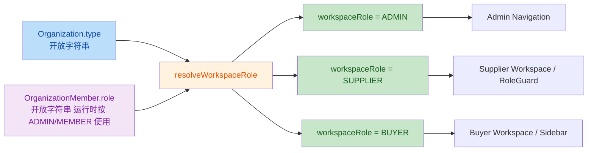

# M14.2.4.4B WorkspaceRole Model Alignment Report

## 1. Review Summary

- 任务编号：`M14.2.4.4B`
- 任务名称：`WorkspaceRole Model Alignment Review`
- 当前阶段：`M14.2.4 工作区收口阶段`
- 前置任务：`M14.2.4.4A Auth/RBAC Freeze Review`
- 审查方式：只读分析，不修改 TypeScript / Prisma Schema / migration / Auth / RoleGuard / WorkspaceSidebar / DTO / API，不安装依赖
- Git 仓库根目录：`F:\Desktop\VISNDT`
- 业务代码目录：`F:\Desktop\VISNDT\VISNDT`
- 报告目录：`F:\Desktop\VISNDT\docs\_review`
- 当前分支：`main`
- Build 结果：未执行。本任务为模型对齐审查，无代码变更

本次审查聚焦三套角色语义：

1. `Organization.type`：组织业务身份
2. `OrganizationMember.role`：组织内权限级别
3. `workspaceRole`：前端工作区入口与页面守卫使用的派生角色

核心结论：

1. 当前系统把“组织身份”“组织内权限”“工作区人格”三层语义压缩到了开放字符串字段和一个三态派生值中
2. `workspaceRole` 的生成规则与 `Organization.type` 的开放模型不兼容
3. `MANUFACTURER` 等真实存在的供给侧组织类型会被错误折叠为 `BUYER`
4. `ADMIN` 既被当作组织内权限，又被当作工作区人格，导致权限与导航语义混用

## 2. Current Role Model Analysis

当前真实模型不是三套并列枚举，而是三层不同语义：

- 第一层：`Organization.type`
  - 语义：组织是什么
  - 当前实现：开放字符串
- 第二层：`OrganizationMember.role`
  - 语义：成员在组织内拥有什么权限
  - 当前实现：开放字符串，但运行时主要按 `ADMIN / MEMBER` 理解
- 第三层：`workspaceRole`
  - 语义：前端应该给用户展示哪类工作区入口
  - 当前实现：由前两者派生，允许值仅 `ADMIN / SUPPLIER / BUYER / null`

这三层的真实关系是：

- `Organization.type` 不等于 `OrganizationMember.role`
- `OrganizationMember.role` 也不等于 `workspaceRole`
- 当前代码却把 `workspaceRole` 做成了对前两层的“有损压缩”

## 3. Organization.type Analysis

### 当前字段

- Schema：[`database/prisma/schema.prisma:205-223`](file:///F:/Desktop/VISNDT/VISNDT/database/prisma/schema.prisma#L205-L223)
- 字段定义：`type String @map("organization_type")`
- 类型：`String`
- 约束：无 Prisma enum，无 DTO enum，无 Service 层限制

### 允许值

当前代码层面允许任意字符串：

- [`apps/api/src/organizations/dto/create-organization.dto.ts:4-11`](file:///F:/Desktop/VISNDT/VISNDT/apps/api/src/organizations/dto/create-organization.dto.ts#L4-L11)
- [`apps/api/src/organizations/dto/update-organization.dto.ts:5-19`](file:///F:/Desktop/VISNDT/VISNDT/apps/api/src/organizations/dto/update-organization.dto.ts#L5-L19)
- [`apps/api/src/organizations/organizations.service.ts:98-104`](file:///F:/Desktop/VISNDT/VISNDT/apps/api/src/organizations/organizations.service.ts#L98-L104)

也就是说，当前没有后端写入约束来限制：

- 大小写
- 枚举集合
- 供给侧 / 采购侧分类

### 实际使用值

从测试数据脚本观察到的实际组织类型：

- `MANUFACTURER`
  - [`create_test_data.ps1:64-67`](file:///F:/Desktop/VISNDT/VISNDT/create_test_data.ps1#L64-L67)
  - [`create_test_data.ps1:83-86`](file:///F:/Desktop/VISNDT/VISNDT/create_test_data.ps1#L83-L86)

同时，代码中还存在以下信号：

- DTO 示例写的是 `supplier` 小写，而非统一枚举
  - [`create-organization.dto.ts:9-11`](file:///F:/Desktop/VISNDT/VISNDT/apps/api/src/organizations/dto/create-organization.dto.ts#L9-L11)
- Auth 派生逻辑只显式识别 `SUPPLIER`
  - [`apps/api/src/auth/auth.service.ts:261-265`](file:///F:/Desktop/VISNDT/VISNDT/apps/api/src/auth/auth.service.ts#L261-L265)

### 风险

1. 开放字符串与硬编码映射不一致
2. `MANUFACTURER` 已在测试数据中真实存在，但不会被识别为供给侧工作区
3. 大小写或别名差异也会直接改变 `workspaceRole` 派生结果
4. `Organization.type` 当前更像“业务身份标签”，不适合直接承担工作区权限语义

## 4. OrganizationMember.role Analysis

### 当前字段

- Schema：[`database/prisma/schema.prisma:248-260`](file:///F:/Desktop/VISNDT/VISNDT/database/prisma/schema.prisma#L248-L260)
- 字段定义：`role String @default("MEMBER")`
- 类型：`String`
- 默认值：`MEMBER`

### 用途

`OrganizationMember.role` 当前主要承担两类职责：

1. 组织内管理权限
   - `RolesGuard` 直接读取 membership.role 与 `Role.ADMIN / Role.MEMBER` 比较
   - 证据：[`apps/api/src/auth/guards/roles.guard.ts:36-50`](file:///F:/Desktop/VISNDT/VISNDT/apps/api/src/auth/guards/roles.guard.ts#L36-L50)
2. `workspaceRole` 的 ADMIN 覆盖条件
   - 证据：[`apps/api/src/auth/auth.service.ts:249-255`](file:///F:/Desktop/VISNDT/VISNDT/apps/api/src/auth/auth.service.ts#L249-L255)

### 允许值

字段本身仍是开放字符串，写入没有 enum 限制：

- 用户创建可直接传任意 `role`
  - [`apps/api/src/users/dto/create-user.dto.ts:19-27`](file:///F:/Desktop/VISNDT/VISNDT/apps/api/src/users/dto/create-user.dto.ts#L19-L27)
  - [`apps/api/src/users/users.service.ts:113-121`](file:///F:/Desktop/VISNDT/VISNDT/apps/api/src/users/users.service.ts#L113-L121)
- 组织加成员也可直接传任意 `role`
  - [`apps/api/src/organization-members/dto/add-member.dto.ts:4-12`](file:///F:/Desktop/VISNDT/VISNDT/apps/api/src/organization-members/dto/add-member.dto.ts#L4-L12)
  - [`apps/api/src/organization-members/organization-members.service.ts:29-35`](file:///F:/Desktop/VISNDT/VISNDT/apps/api/src/organization-members/organization-members.service.ts#L29-L35)

### 是否参与 Workspace 权限判断

参与，但参与方式不完整：

- `ADMIN`：会直接把 `workspaceRole` 变成 `ADMIN`
- 非 `ADMIN`：不会直接区分供给侧或采购侧，仍然依赖 `Organization.type`

因此，`OrganizationMember.role` 当前并不是 Workspace 角色体系本身，而是“组织内权限 + 一个 ADMIN 特判”。

## 5. workspaceRole Analysis

### 来源

`workspaceRole` 不是数据库字段，而是 Auth 层派生字段。

### 生成位置

- 类型定义：[`apps/api/src/auth/auth.service.ts:17-18`](file:///F:/Desktop/VISNDT/VISNDT/apps/api/src/auth/auth.service.ts#L17-L18)
- 返回组装：[`apps/api/src/auth/auth.service.ts:225-246`](file:///F:/Desktop/VISNDT/VISNDT/apps/api/src/auth/auth.service.ts#L225-L246)
- 派生函数：[`apps/api/src/auth/auth.service.ts:249-266`](file:///F:/Desktop/VISNDT/VISNDT/apps/api/src/auth/auth.service.ts#L249-L266)

### 生成规则

当前规则严格如下：

1. 如果 `organizationMember.role === ADMIN`，返回 `ADMIN`
2. 否则，如果 `organization.type` 为空，返回 `null`
3. 否则，如果 `organization.type === 'SUPPLIER'`，返回 `SUPPLIER`
4. 其他所有非空组织类型，统一返回 `BUYER`

### 当前允许值

- Backend 类型：`'ADMIN' | 'SUPPLIER' | 'BUYER' | null`
  - [`apps/api/src/auth/auth.service.ts:17-18`](file:///F:/Desktop/VISNDT/VISNDT/apps/api/src/auth/auth.service.ts#L17-L18)
- DTO 契约：`ADMIN / SUPPLIER / BUYER`
  - [`apps/api/src/auth/dto/auth-response.dto.ts:46-51`](file:///F:/Desktop/VISNDT/VISNDT/apps/api/src/auth/dto/auth-response.dto.ts#L46-L51)
- 前端类型：`ADMIN / SUPPLIER / BUYER | null`
  - [`apps/web/src/services/auth.service.ts:11-30`](file:///F:/Desktop/VISNDT/VISNDT/apps/web/src/services/auth.service.ts#L11-L30)

### 是否存在 UNKNOWN / PENDING

- `workspaceRole` 不存在 `UNKNOWN`
- `workspaceRole` 不存在 `PENDING`
- 但存在 `null`
- 更危险的是：前端会把 `null` 静默回退成 `BUYER`
  - [`apps/web/src/auth/RoleGuard.tsx:21-22`](file:///F:/Desktop/VISNDT/VISNDT/apps/web/src/auth/RoleGuard.tsx#L21-L22)
  - [`apps/web/src/components/workspace/WorkspaceSidebar.tsx:49-50`](file:///F:/Desktop/VISNDT/VISNDT/apps/web/src/components/workspace/WorkspaceSidebar.tsx#L49-L50)

### workspaceRole 消费方式

前端对 `workspaceRole` 的依赖已经是真实运行路径，而不是展示文案：

- Supplier 页面守卫要求 `SUPPLIER`
  - [`apps/web/src/app/workspace/supplier/page.tsx:21`](file:///F:/Desktop/VISNDT/VISNDT/apps/web/src/app/workspace/supplier/page.tsx#L21)
  - [`apps/web/src/app/workspace/supplier/rfqs/page.tsx:64`](file:///F:/Desktop/VISNDT/VISNDT/apps/web/src/app/workspace/supplier/rfqs/page.tsx#L64)
- Sidebar 按 `workspaceRole` 分发导航
  - [`apps/web/src/components/workspace/WorkspaceSidebar.tsx:17-38`](file:///F:/Desktop/VISNDT/VISNDT/apps/web/src/components/workspace/WorkspaceSidebar.tsx#L17-L38)

## 6. Conflict Case Analysis

### Case 1

- 条件：
  - `Organization.type = MANUFACTURER`
  - `OrganizationMember.role = MEMBER`
- 当前结果：
  - `workspaceRole = BUYER`
  - 依据：`MANUFACTURER` 非空且不等于 `SUPPLIER`
- 业务期望：
  - 应进入供给侧工作区，而不是采购侧工作区
- 结论：
  - 这是当前最大模型冲突

原因：

1. 测试数据把“供应商组织”实际创建成 `MANUFACTURER`
2. Frontend Supplier Workspace 却只认 `workspaceRole = SUPPLIER`
3. 结果是制造商成员会被错误导航到 Buyer 侧，并被 Supplier 页面拒绝

### Case 2

- 条件：
  - `Organization.type = SUPPLIER`
  - `OrganizationMember.role = MEMBER`
- 当前结果：
  - `workspaceRole = SUPPLIER`
- 业务期望：
  - 基本一致
- 结论：
  - 这是当前唯一与映射逻辑完全对齐的供给侧 case

### Case 3

- 条件：
  - `Organization.type` 未知字符串，例如非 `SUPPLIER` 的任意值
- 当前结果：
  - `workspaceRole = BUYER`
- 如果 `Organization.type = null`
  - `workspaceRole = null`
  - 但前端仍会回退到 `BUYER`

风险：

1. 未知组织类型被误认成采购侧，而不是显式报错或待配置态
2. 数据问题会被静默吞掉，最终表现为导航错误和访问拒绝
3. 审计时不容易被及时发现，因为 UI 表面上仍能渲染 Buyer 工作区

### Case 4

- 条件：
  - `OrganizationMember.role = ADMIN`
  - `Organization.type` 任意
- 当前结果：
  - `workspaceRole = ADMIN`

是否合理：

- 作为“组织内管理权限覆盖”是部分合理的
- 作为“唯一工作区人格”是不合理的

原因：

1. `ADMIN` 表示权限级别，不等于组织的业务侧身份
2. 供应侧组织管理员仍可能需要 Supplier Workspace，而不应被强制收敛成纯 `ADMIN` 导航
3. 当前 `ADMIN` 把“组织内权限”和“工作区入口”混为一体

## 7. Business Model Alignment

### Organization.type 是否应该等同于 Workspace 角色

结论：**否**

原因：

1. `Organization.type` 描述的是组织业务身份，例如制造商、经销商、供应商、采购方
2. `workspaceRole` 描述的是工作区能力入口，例如供给侧工作区、采购侧工作区、管理入口
3. 多个组织身份可以映射到同一个工作区能力
   - 例如：制造商 / 经销商 / 供应商，都可能属于供给侧工作区
4. `OrganizationMember.role` 应单独表达组织内权限级别，而不是替代工作区业务人格

### Supplier Workspace 代表什么

判断：**B. 供应业务工作能力**

原因：

1. Supplier Workspace 承接的是 RFQ 响应、响应列表、供应侧工作台
2. 这些是供给侧业务能力，不是某个单一组织类型标签
3. 因此，`Supplier Workspace` 更像“供给侧工作模式”，而不是“组织身份必须等于 SUPPLIER”

### 业务影响

1. 制造商组织会被误判为 Buyer，导致供给侧页面无法进入
2. 组织管理员会被压缩成 `ADMIN`，可能失去业务工作台入口
3. 组织类型扩展越多，误判越多，因为当前默认分支是 `BUYER`
4. 角色错误会直接落到导航、页面守卫和工作流入口，不是纯文档问题

## 8. Target Model Recommendation

### 方案 A：保持 Organization.type 开放，增加 workspaceRole 映射规则

描述：

- `Organization.type` 继续保留业务身份标签能力
- 在应用层建立显式映射表
- `workspaceRole` 只表达工作区业务人格
- `OrganizationMember.role` 单独表达组织内权限级别

建议映射方式：

- 供给侧组织类型：
  - `SUPPLIER`
  - `MANUFACTURER`
  - 后续如有 `DISTRIBUTOR` / `DEALER` 也归入供给侧
  - 映射到 `workspaceRole = SUPPLIER`
- 采购侧组织类型：
  - `BUYER`
  - 后续采购方别名
  - 映射到 `workspaceRole = BUYER`
- 未识别类型：
  - 返回显式未映射态或拒绝进入工作区
  - 不能静默落成 `BUYER`
- `OrganizationMember.role = ADMIN`
  - 保持为权限维度
  - 不再覆盖业务工作区人格

优点：

1. 不强迫数据库立即迁移
2. 能兼容 VISNDT 需要支持的多种组织身份
3. 能把“业务身份”和“权限级别”拆开
4. 最适合当前收口阶段的最小改动原则

缺点：

1. 需要维护映射表
2. 需要前后端共同遵守同一份映射契约
3. 若继续保留开放字符串，仍需防范脏数据

### 方案 B：限制 Organization.type 枚举

描述：

- 把 `Organization.type` 改造成受控枚举
- 所有组织只能使用白名单值
- 再由枚举直接映射到工作区角色

优点：

1. 数据边界更清晰
2. 更容易做静态校验和测试覆盖
3. 从根上减少大小写和别名问题

缺点：

1. 需要 Prisma Schema、DTO、历史数据、迁移脚本一起调整
2. 对冻结阶段和最小修复目标来说过重
3. 若业务需要制造商/经销商/供应商并存，仍然要处理“组织身份 != 工作区人格”的问题

### 推荐方案

推荐：**方案 A**

推荐理由：

1. 当前主要问题不是数据库没有 enum，而是模型语义混用
2. 先把映射规则明确下来，可以在不动数据库的前提下恢复业务正确性
3. 这更符合当前工作区收口阶段的目标，也更适合 Commit A 之前的最小收敛

推荐目标模型：

- `Organization.type`：组织业务身份
- `OrganizationMember.role`：组织内权限级别
- `workspaceRole`：工作区业务人格

其中：

- `Organization.type` 不直接等于 `workspaceRole`
- `OrganizationMember.role` 不直接覆盖 `workspaceRole`
- `workspaceRole` 应由“组织身份映射规则”生成，并对未知值显式失败

## 9. Minimal Fix Path

以下仅描述最小修复路径，不写代码。

### Backend

需要影响的模块：

- `apps/api/src/auth/auth.service.ts`
  - 调整 `workspaceRole` 生成规则
- `apps/api/src/auth/dto/auth-response.dto.ts`
  - 对齐真实契约语义
- `apps/api/src/auth/interfaces/auth-request.interface.ts`
  - 对齐角色语义
- `apps/api/src/organizations/**`
  - 至少在 DTO / Service 层明确组织类型白名单或映射来源

最小修复动作：

1. 明确供给侧与采购侧组织类型映射表
2. 未识别类型不再默认映射到 `BUYER`
3. `ADMIN` 从“工作区人格”中剥离为权限维度，或至少不再掩盖供给 / 采购工作区人格

### Frontend

需要影响的模块：

- `apps/web/src/services/auth.service.ts`
- `apps/web/src/auth/RoleGuard.tsx`
- `apps/web/src/components/workspace/WorkspaceSidebar.tsx`
- `apps/web/src/app/workspace/supplier/**`

最小修复动作：

1. 去掉 `workspaceRole ?? 'BUYER'` 的静默回退
2. 对未映射角色显示显式异常态、待配置态或拒绝进入
3. Supplier 页面守卫与 Sidebar 导航改为消费“正确的工作区人格”，不是脏数据兜底

### Database

- 推荐方案 A 下：**不需要数据库结构变化**
- 仅需补充映射规则与契约治理
- 若采用方案 B，则需要 Prisma Schema 与历史数据迁移

### API

受影响接口：

- `/auth/login`
- `/auth/refresh`
- `/auth/me`

影响点：

1. `user.workspaceRole` 的语义需要重新定义为“工作区人格”而非“权限覆盖结果”
2. `organization.type` 与 `organizationMember.role` 的真实语义需要继续透出
3. 对外契约必须明确未知类型处理方式

## 10. Commit A Re-entry Conditions

Auth/RBAC 重新允许提交，至少需要满足以下三项：

### 条件 1

已形成并确认一份正式映射矩阵，明确：

- 哪些 `Organization.type` 属于供给侧
- 哪些 `Organization.type` 属于采购侧
- 未知类型如何处理
- `OrganizationMember.role` 与 `workspaceRole` 的职责边界

### 条件 2

已移除当前高风险默认行为：

- 未知或空 `workspaceRole` 不再静默回退为 `BUYER`
- `MANUFACTURER` 等真实供给侧类型不再落到 Buyer 工作区
- `ADMIN` 不再作为唯一工作区人格覆盖业务角色

### 条件 3

已完成契约对齐与最小回归验证：

- Backend `AuthService / DTO / Request Interface` 一致
- Frontend `auth.service / RoleGuard / WorkspaceSidebar / Supplier routes` 一致
- 至少覆盖以下四个 case：
  - `MANUFACTURER + MEMBER`
  - `SUPPLIER + MEMBER`
  - `Unknown type`
  - `ADMIN + supply-side organization`

## 11. Final Conclusion

本次模型对齐审查结论如下：

1. 当前角色体系的真实状态是“三层语义、两层开放字符串、一个有损派生值”
2. 最大冲突点是：`Organization.type = MANUFACTURER` 时，当前 `workspaceRole` 会错误落成 `BUYER`
3. 当前 `workspaceRole` 本质上把组织身份、组织内权限、工作区人格混在了一起
4. VISNDT 的业务模型要求支持制造商、经销商、供应商、采购方，因此 `Organization.type` 不应直接等同于 Workspace 角色
5. 推荐目标模型是：
   - `Organization.type` 表达组织业务身份
   - `OrganizationMember.role` 表达组织内权限级别
   - `workspaceRole` 表达工作区业务人格
6. 推荐采用方案 A，在不改数据库结构的前提下先修正映射规则与前端兜底逻辑

执行后结果：

1. 修改文件
   - `F:\Desktop\VISNDT\docs\_review\332_M14.2.4.4B_WorkspaceRole_Model_Alignment_Report.md`
2. 修改原因
   - 按任务要求生成 WorkspaceRole 模型对齐审查报告
3. 架构影响
   - 仅报告新增，无代码改动
4. 数据库影响
   - 无
5. API 影响
   - 无代码改动；报告中已说明后续最小修复会影响 `/auth/login`、`/auth/refresh`、`/auth/me` 的角色语义
6. Build 结果
   - 未执行（只读审查）
7. Review 报告路径
   - `F:\Desktop\VISNDT\docs\_review\332_M14.2.4.4B_WorkspaceRole_Model_Alignment_Report.md`
