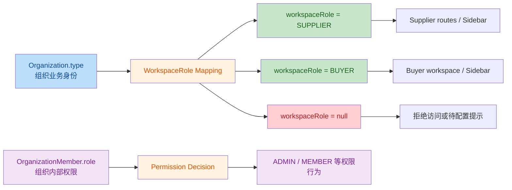

# M14.2.4.4C WorkspaceRole Contract Freeze Specification

## 1. Review Summary

- 任务编号：`M14.2.4.4C`
- 任务名称：`WorkspaceRole Contract Freeze Specification`
- 当前阶段：`M14.2.4 工作区收口阶段`
- 审查方式：只读分析，仅生成冻结规范文档
- Git 仓库根目录：`F:\Desktop\VISNDT`
- 业务代码目录：`F:\Desktop\VISNDT\VISNDT`
- 当前分支：`main`
- 前置报告：[`332_M14.2.4.4B_WorkspaceRole_Model_Alignment_Report.md`](file:///F:/Desktop/VISNDT/docs/_review/332_M14.2.4.4B_WorkspaceRole_Model_Alignment_Report.md)
- 输出报告：[`333_M14.2.4.4C_WorkspaceRole_Contract_Freeze_Specification.md`](file:///F:/Desktop/VISNDT/docs/_review/333_M14.2.4.4C_WorkspaceRole_Contract_Freeze_Specification.md)
- Build 结果：未执行。本任务无代码变更，按要求不执行 Build

本报告的目标不是继续讨论“是否要修”，而是冻结 `workspaceRole` 最终契约，作为后续 `M14.2.4.5 Minimal RBAC Contract Fix` 的唯一设计基线。

冻结结论：

1. `Organization.type` 只表达组织业务身份
2. `OrganizationMember.role` 只表达组织内部权限级别
3. `workspaceRole` 只表达工作区业务人格
4. `ADMIN` 不再属于 `workspaceRole` 枚举
5. `UNKNOWN / NULL` 不得再静默回退为 `BUYER`

## 2. Current Role Model

### 2.1 当前数据库与运行时事实

`Organization.type` 当前是开放字符串：

- [`schema.prisma:205-223`](file:///F:/Desktop/VISNDT/VISNDT/database/prisma/schema.prisma#L205-L223)
- [`create-organization.dto.ts:4-11`](file:///F:/Desktop/VISNDT/VISNDT/apps/api/src/organizations/dto/create-organization.dto.ts#L4-L11)
- [`update-organization.dto.ts:5-19`](file:///F:/Desktop/VISNDT/VISNDT/apps/api/src/organizations/dto/update-organization.dto.ts#L5-L19)
- [`organizations.service.ts:98-104`](file:///F:/Desktop/VISNDT/VISNDT/apps/api/src/organizations/organizations.service.ts#L98-L104)

`OrganizationMember.role` 当前也是开放字符串，运行时主要按 `ADMIN / MEMBER` 理解：

- [`schema.prisma:248-260`](file:///F:/Desktop/VISNDT/VISNDT/database/prisma/schema.prisma#L248-L260)
- [`create-user.dto.ts:19-27`](file:///F:/Desktop/VISNDT/VISNDT/apps/api/src/users/dto/create-user.dto.ts#L19-L27)
- [`users.service.ts:113-121`](file:///F:/Desktop/VISNDT/VISNDT/apps/api/src/users/users.service.ts#L113-L121)
- [`add-member.dto.ts:4-12`](file:///F:/Desktop/VISNDT/VISNDT/apps/api/src/organization-members/dto/add-member.dto.ts#L4-L12)
- [`organization-members.service.ts:29-34`](file:///F:/Desktop/VISNDT/VISNDT/apps/api/src/organization-members/organization-members.service.ts#L29-L34)

`workspaceRole` 不是数据库字段，而是 Auth 层派生值：

- [`auth.service.ts:17-18`](file:///F:/Desktop/VISNDT/VISNDT/apps/api/src/auth/auth.service.ts#L17-L18)
- [`auth.service.ts:225-266`](file:///F:/Desktop/VISNDT/VISNDT/apps/api/src/auth/auth.service.ts#L225-L266)

### 2.2 当前派生规则

当前后端逻辑是：

1. `organizationMember.role === ADMIN` 时直接返回 `workspaceRole = ADMIN`
2. `organization.type` 为空时返回 `null`
3. `organization.type === 'SUPPLIER'` 时返回 `SUPPLIER`
4. 其他所有非空 `organization.type` 全部返回 `BUYER`

证据：

- [`auth.service.ts:249-266`](file:///F:/Desktop/VISNDT/VISNDT/apps/api/src/auth/auth.service.ts#L249-L266)

### 2.3 当前前端消费方式

前端当前继续把 `null` 静默回退到 `BUYER`：

- [`RoleGuard.tsx:21-22`](file:///F:/Desktop/VISNDT/VISNDT/apps/web/src/auth/RoleGuard.tsx#L21-L22)
- [`WorkspaceSidebar.tsx:49-50`](file:///F:/Desktop/VISNDT/VISNDT/apps/web/src/components/workspace/WorkspaceSidebar.tsx#L49-L50)

Supplier 路由严格要求 `SUPPLIER`：

- [`workspace/supplier/page.tsx:21`](file:///F:/Desktop/VISNDT/VISNDT/apps/web/src/app/workspace/supplier/page.tsx#L21)
- [`workspace/supplier/rfqs/page.tsx:64`](file:///F:/Desktop/VISNDT/VISNDT/apps/web/src/app/workspace/supplier/rfqs/page.tsx#L64)

### 2.4 当前冲突点

当前真实冲突仍然是：

1. `Organization.type` 被当作业务身份
2. `OrganizationMember.role` 被当作权限级别
3. `workspaceRole` 却把这两层信息压缩成 `ADMIN / SUPPLIER / BUYER / null`

其中最直接的错误案例是测试数据中的 `MANUFACTURER`：

- [`create_test_data.ps1:64-86`](file:///F:/Desktop/VISNDT/VISNDT/create_test_data.ps1#L64-L86)

该值当前不会命中 `SUPPLIER` 分支，因此会被错误折叠为 `BUYER`。

## 3. Final Role Responsibility Boundary

本节为最终冻结口径。自本报告起，下列职责边界不得再混用。

### 3.1 Organization.type

冻结定义：`Organization.type = 组织业务身份`

允许承担的语义：

- 供应侧身份，如 `SUPPLIER`、`MANUFACTURER`、`DISTRIBUTOR`
- 采购侧身份，如 `BUYER`
- 未来同类业务身份扩展

禁止承担的语义：

- 不直接等同 `workspaceRole`
- 不直接表达组织内权限
- 不直接决定 `ADMIN`

### 3.2 OrganizationMember.role

冻结定义：`OrganizationMember.role = 组织内部权限级别`

允许承担的语义：

- `ADMIN / MEMBER` 之类的组织内部授权
- 后端 `@Roles(Role.ADMIN)` 等权限控制

证据：

- [`roles.guard.ts:36-50`](file:///F:/Desktop/VISNDT/VISNDT/apps/api/src/auth/guards/roles.guard.ts#L36-L50)

禁止承担的语义：

- 不直接充当 `workspaceRole`
- 不覆盖 Supplier / Buyer 的工作区人格判断

### 3.3 workspaceRole

冻结定义：`workspaceRole = 工作区业务人格`

最终冻结枚举：

- `SUPPLIER`
- `BUYER`
- `null`

冻结说明：

1. `workspaceRole` 不再包含 `ADMIN`
2. `workspaceRole = null` 表示“未映射 / 不可进入业务工作区”，不是 Buyer 兜底值
3. `workspaceRole` 必须由 `Organization.type` 映射得出，而不是由 `OrganizationMember.role` 覆盖得出

## 4. Organization.type -> workspaceRole Mapping Matrix

以下矩阵为 `4.4C` 正式冻结结果，后续前后端都必须按此消费。

| Organization.type | 业务归类 | workspaceRole | 说明 |
|---|---|---|---|
| `SUPPLIER` | 供给侧 | `SUPPLIER` | 当前已在代码中显式识别 |
| `MANUFACTURER` | 供给侧 | `SUPPLIER` | 当前测试数据已真实存在，冻结后不得再落到 `BUYER` |
| `DISTRIBUTOR` | 供给侧 | `SUPPLIER` | 当前代码未显式实现；本次作为冻结矩阵保留位 |
| `BUYER` | 采购侧 | `BUYER` | 采购侧工作区人格 |
| `UNKNOWN` 或其他未识别字符串 | 未映射 | `null` | 禁止静默映射到 `BUYER` |
| `NULL / 空字符串` | 未映射 | `null` | 禁止静默映射到 `BUYER` |

冻结规则补充：

1. 供给侧允许“一组组织业务身份映射到同一个 `workspaceRole = SUPPLIER`”
2. `workspaceRole` 是归一化工作区人格，不是原始组织类型枚举镜像
3. 本次冻结不引入新的数据库字段，不改 Prisma enum

## 5. ADMIN Handling Rule

### 5.1 冻结结论

`ADMIN` 不属于 `workspaceRole`。

`ADMIN` 仅属于权限维度，来源于 `OrganizationMember.role`。

### 5.2 原因

当前后端 `RolesGuard` 已经把 `membership.role` 用作权限判断，而不是工作区人格判断：

- [`roles.guard.ts:36-50`](file:///F:/Desktop/VISNDT/VISNDT/apps/api/src/auth/guards/roles.guard.ts#L36-L50)

如果继续把 `ADMIN` 放进 `workspaceRole`，会造成两个问题：

1. 供应侧管理员会失去 `SUPPLIER` 工作区人格，错误落入独立 `ADMIN` 导航
2. 权限维度与工作区人格维度再次混用，违背 `4.4B` 已通过的模型边界

### 5.3 冻结规则

1. `organizationMember.role = ADMIN` 仅表示该成员拥有组织管理权限
2. 该成员的业务工作区人格仍由 `Organization.type -> workspaceRole` 映射决定
3. 后端 Admin-only 接口继续由 `@Roles(Role.ADMIN)` 与 `RolesGuard` 控制
4. 前端若需要展示管理入口，必须基于权限维度附加展示，而不是把 `workspaceRole` 改造成 `ADMIN`

## 6. Unknown / Null Handling

### 6.1 冻结结论

本次冻结选择：`UNKNOWN / NULL -> workspaceRole = null -> 拒绝进入业务工作区`

本次不引入 `PENDING` 枚举，不新增角色体系。

### 6.2 明确禁止

明确禁止以下行为：

1. `unknown -> BUYER`
2. `null -> BUYER`
3. 前端以 `workspaceRole ?? 'BUYER'` 方式兜底

### 6.3 前后端处理规则

Backend：

1. 未识别 `Organization.type` 返回 `workspaceRole = null`
2. 保留原始 `organization.type` 供排查与审计

Frontend：

1. `RoleGuard` 遇到 `workspaceRole = null` 时必须拒绝访问
2. `WorkspaceSidebar` 遇到 `workspaceRole = null` 时不得渲染 Buyer 导航
3. Supplier routes 遇到 `null` 时必须拒绝进入

## 7. Auth API Contract

### 7.1 当前代码事实

Auth 后端控制器：

- `/auth/login`：[`auth.controller.ts:83-96`](file:///F:/Desktop/VISNDT/VISNDT/apps/api/src/auth/auth.controller.ts#L83-L96)
- `/auth/refresh`：[`auth.controller.ts:98-116`](file:///F:/Desktop/VISNDT/VISNDT/apps/api/src/auth/auth.controller.ts#L98-L116)
- `/auth/me`：[`auth.controller.ts:128-136`](file:///F:/Desktop/VISNDT/VISNDT/apps/api/src/auth/auth.controller.ts#L128-L136)

通用响应包装：

- [`api-response.dto.ts:3-29`](file:///F:/Desktop/VISNDT/VISNDT/apps/api/src/common/dto/api-response.dto.ts#L3-L29)

前端消费方式：

- `login`：[`auth.service.ts:56-62`](file:///F:/Desktop/VISNDT/VISNDT/apps/web/src/services/auth.service.ts#L56-L62)
- `getMe`：[`auth.service.ts:92-98`](file:///F:/Desktop/VISNDT/VISNDT/apps/web/src/services/auth.service.ts#L92-L98)
- `refresh` 自动重试：[`api-client.ts:31-53`](file:///F:/Desktop/VISNDT/VISNDT/apps/web/src/lib/api-client.ts#L31-L53)

### 7.2 最终冻结契约

`/auth/login`

1. HttpOnly Cookie 继续承载 `access_token` 与 `refresh_token`
2. 响应体冻结为：`ApiResponse<{ user: AuthUserContract }>`
3. `workspaceRole` 必须按本报告映射矩阵返回，不得再返回由 `ADMIN` 覆盖得到的值

`/auth/refresh`

1. 继续执行 refresh token rotation
2. 响应体冻结为：`ApiResponse<{ user: AuthUserContract }>`
3. 刷新后的 `user.workspaceRole` 必须与 `/auth/login`、`/auth/me` 保持同一规则

`/auth/me`

1. 响应体冻结为：`ApiResponse<AuthUserContract>`
2. 返回的 `organization.type`、`organizationMember.role`、`workspaceRole` 三层语义必须同时保留

### 7.3 AuthUserContract 冻结字段

`AuthUserContract` 必须至少包含：

1. `organization.type: string | null`
2. `organizationMember.role: string | null`
3. `workspaceRole: 'SUPPLIER' | 'BUYER' | null`

### 7.4 当前契约偏差说明

当前 Swagger DTO 仍声明 `workspaceRole` 可为 `ADMIN`，且登录响应 DTO 仍带 `accessToken` 字段：

- [`auth-response.dto.ts:46-60`](file:///F:/Desktop/VISNDT/VISNDT/apps/api/src/auth/dto/auth-response.dto.ts#L46-L60)

但控制器当前实际返回体是 `ApiResponse.ok({ user })`，而不是 body 内直接返回 `accessToken`：

- [`auth.controller.ts:89-95`](file:///F:/Desktop/VISNDT/VISNDT/apps/api/src/auth/auth.controller.ts#L89-L95)
- [`auth.controller.ts:110-115`](file:///F:/Desktop/VISNDT/VISNDT/apps/api/src/auth/auth.controller.ts#L110-L115)

因此，`4.5` 必须至少先把运行时与类型契约统一到同一口径。

## 8. Frontend Consumption Contract

### 8.1 RoleGuard

当前问题：

- [`RoleGuard.tsx:21-22`](file:///F:/Desktop/VISNDT/VISNDT/apps/web/src/auth/RoleGuard.tsx#L21-L22)

冻结规则：

1. `RoleGuard` 只能消费真实 `workspaceRole`
2. 不得把 `null` 或未识别值回退成 `BUYER`
3. 当 `workspaceRole = null` 时，返回拒绝访问态
4. `RoleGuard` 的可比较枚举应与冻结后的 `workspaceRole` 保持一致，不再依赖 `ADMIN` 作为工作区人格

### 8.2 WorkspaceSidebar

当前问题：

- [`WorkspaceSidebar.tsx:49-50`](file:///F:/Desktop/VISNDT/VISNDT/apps/web/src/components/workspace/WorkspaceSidebar.tsx#L49-L50)

冻结规则：

1. 侧边栏主导航只能按 `workspaceRole` 选择 `SUPPLIER` 或 `BUYER`
2. `workspaceRole = null` 时不得渲染 Buyer 默认导航
3. 若需要 Admin 快捷入口，必须作为权限附加项，而不是新的 workspaceRole 分支

### 8.3 Supplier routes

当前 Supplier 路由：

- [`workspace/supplier/page.tsx`](file:///F:/Desktop/VISNDT/VISNDT/apps/web/src/app/workspace/supplier/page.tsx)
- [`workspace/supplier/rfqs/page.tsx`](file:///F:/Desktop/VISNDT/VISNDT/apps/web/src/app/workspace/supplier/rfqs/page.tsx)
- [`workspace/supplier/rfqs/[id]/page.tsx`](file:///F:/Desktop/VISNDT/VISNDT/apps/web/src/app/workspace/supplier/rfqs/%5Bid%5D/page.tsx)
- [`workspace/supplier/responses/page.tsx`](file:///F:/Desktop/VISNDT/VISNDT/apps/web/src/app/workspace/supplier/responses/page.tsx)

冻结规则：

1. 以上路由只接受 `workspaceRole = SUPPLIER`
2. `MANUFACTURER`、`DISTRIBUTOR` 等供给侧组织必须先被映射为 `SUPPLIER`，而不是在页面层做例外判断
3. 页面层不允许直接发明新的角色兜底逻辑

## 9. M14.2.4.5 Minimal Fix Boundary

### 9.1 允许修改

后端允许修改文件：

1. [`apps/api/src/auth/auth.service.ts`](file:///F:/Desktop/VISNDT/VISNDT/apps/api/src/auth/auth.service.ts)
2. [`apps/api/src/auth/dto/auth-response.dto.ts`](file:///F:/Desktop/VISNDT/VISNDT/apps/api/src/auth/dto/auth-response.dto.ts)
3. [`apps/api/src/auth/interfaces/auth-request.interface.ts`](file:///F:/Desktop/VISNDT/VISNDT/apps/api/src/auth/interfaces/auth-request.interface.ts)

前端允许修改文件：

1. [`apps/web/src/services/auth.service.ts`](file:///F:/Desktop/VISNDT/VISNDT/apps/web/src/services/auth.service.ts)
2. [`apps/web/src/auth/RoleGuard.tsx`](file:///F:/Desktop/VISNDT/VISNDT/apps/web/src/auth/RoleGuard.tsx)
3. [`apps/web/src/components/workspace/WorkspaceSidebar.tsx`](file:///F:/Desktop/VISNDT/VISNDT/apps/web/src/components/workspace/WorkspaceSidebar.tsx)
4. [`apps/web/src/app/workspace/supplier/page.tsx`](file:///F:/Desktop/VISNDT/VISNDT/apps/web/src/app/workspace/supplier/page.tsx)
5. [`apps/web/src/app/workspace/supplier/rfqs/page.tsx`](file:///F:/Desktop/VISNDT/VISNDT/apps/web/src/app/workspace/supplier/rfqs/page.tsx)
6. [`apps/web/src/app/workspace/supplier/rfqs/[id]/page.tsx`](file:///F:/Desktop/VISNDT/VISNDT/apps/web/src/app/workspace/supplier/rfqs/%5Bid%5D/page.tsx)
7. [`apps/web/src/app/workspace/supplier/responses/page.tsx`](file:///F:/Desktop/VISNDT/VISNDT/apps/web/src/app/workspace/supplier/responses/page.tsx)

### 9.2 禁止修改

`4.5` 继续禁止以下修改：

1. `database/prisma/schema.prisma`
2. `database/migrations/**`
3. 任何新增数据库字段、枚举、迁移
4. 任何新增角色体系
5. 任何扩展权限系统或改变既有业务闭环
6. Supplier Store / 独立商城 / 交易支付相关模块

### 9.3 范围说明

`4.5` 的目标是最小契约修复，不是角色系统重构。

因此只允许：

1. 修正 `workspaceRole` 派生逻辑
2. 修正 Auth 类型/DTO/请求上下文中的 `workspaceRole` 定义
3. 去掉前端对 `BUYER` 的静默兜底
4. 让 Supplier 路由消费冻结后的统一人格

## 10. Entry Criteria for M14.2.4.5

满足以下条件后，可进入 `M14.2.4.5`：

1. `Organization.type / OrganizationMember.role / workspaceRole` 三层边界已正式冻结
2. `Organization.type -> workspaceRole` 映射矩阵已冻结并覆盖 `SUPPLIER / MANUFACTURER / DISTRIBUTOR / BUYER / UNKNOWN`
3. 已明确 `ADMIN` 只属于权限维度，不再属于 `workspaceRole`
4. 已明确 `UNKNOWN / NULL -> null -> 拒绝访问`，禁止回退 `BUYER`
5. 已明确 `/auth/login`、`/auth/refresh`、`/auth/me` 的统一角色契约
6. 已明确 `RoleGuard`、`WorkspaceSidebar`、Supplier routes 的前端消费规则
7. 已明确 `4.5` 允许修改与禁止修改边界

结论：**本报告完成后，已满足进入 `M14.2.4.5` 的设计冻结条件。**

## 11. Final Conclusion

本次 `4.4C` 冻结规范的最终结论如下：

1. `Organization.type` 是组织业务身份，不是工作区角色
2. `OrganizationMember.role` 是组织内部权限级别，不是工作区人格
3. `workspaceRole` 是工作区业务人格，最终冻结为 `SUPPLIER | BUYER | null`
4. `ADMIN` 从 `workspaceRole` 中移除，只保留在权限维度
5. `MANUFACTURER`、`DISTRIBUTOR` 等供给侧身份统一映射到 `workspaceRole = SUPPLIER`
6. `UNKNOWN / NULL` 必须返回 `null` 并拒绝业务工作区访问，禁止静默落到 `BUYER`
7. 后续 `4.5` 只做最小代码修复，不改数据库、不引入新角色体系

## 12. Execution Result

1. 修改文件
   - `F:\Desktop\VISNDT\docs\_review\333_M14.2.4.4C_WorkspaceRole_Contract_Freeze_Specification.md`
2. 修改原因
   - 按任务要求生成 WorkspaceRole 最终契约冻结规范，作为 `M14.2.4.5` 的设计基线
3. 架构影响
   - 仅新增审查文档，无业务代码改动；冻结了角色职责边界与前后端消费契约
4. 数据库影响
   - 无；明确冻结为“不修改 Prisma Schema、不做 migration”
5. API 影响
   - 无运行时代码变更；文档冻结了 `/auth/login`、`/auth/refresh`、`/auth/me` 的最终角色契约
6. Build 结果
   - 未执行（本任务无代码修改，按要求无需执行 Build）
7. Review 报告路径
   - [`333_M14.2.4.4C_WorkspaceRole_Contract_Freeze_Specification.md`](file:///F:/Desktop/VISNDT/docs/_review/333_M14.2.4.4C_WorkspaceRole_Contract_Freeze_Specification.md)
