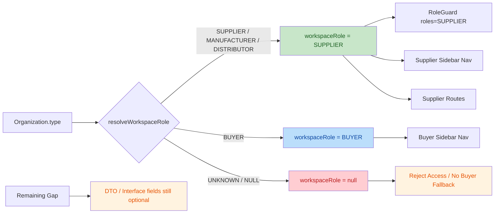

# M14.2.4.5C RBAC Workspace Contract Freeze Review

## 1. Review Summary

- 任务编号：`M14.2.4.5C`
- 任务名称：`RBAC Workspace Contract Freeze Review`
- 审查目标：核对 `M14.2.4.5A + M14.2.4.5B` 实际代码结果是否**完全符合** `4.4C WorkspaceRole Contract Freeze Specification`
- 审查方式：`git diff` + 源码静态对照 + Backend Build + Frontend Build
- Git 仓库根目录：`F:\Desktop\VISNDT`
- 业务代码根目录：`F:\Desktop\VISNDT\VISNDT`
- 当前分支：`main`
- 冻结规范：[`333_M14.2.4.4C_WorkspaceRole_Contract_Freeze_Specification.md`](file:///F:/Desktop/VISNDT/docs/_review/333_M14.2.4.4C_WorkspaceRole_Contract_Freeze_Specification.md)

结论：**运行时行为已大体对齐冻结规范，但类型/DTO 契约仍存在 1 项中风险偏差，因此当前结果不能判定为“完全符合”，暂不建议直接进入下一阶段。**

## 2. Review Scope

### 2.1 审查文件

Backend:

1. [`apps/api/src/auth/auth.service.ts`](file:///F:/Desktop/VISNDT/VISNDT/apps/api/src/auth/auth.service.ts)
2. [`apps/api/src/auth/dto/auth-response.dto.ts`](file:///F:/Desktop/VISNDT/VISNDT/apps/api/src/auth/dto/auth-response.dto.ts)
3. [`apps/api/src/auth/interfaces/auth-request.interface.ts`](file:///F:/Desktop/VISNDT/VISNDT/apps/api/src/auth/interfaces/auth-request.interface.ts)

Frontend:

1. [`apps/web/src/services/auth.service.ts`](file:///F:/Desktop/VISNDT/VISNDT/apps/web/src/services/auth.service.ts)
2. [`apps/web/src/auth/RoleGuard.tsx`](file:///F:/Desktop/VISNDT/VISNDT/apps/web/src/auth/RoleGuard.tsx)
3. [`apps/web/src/components/workspace/WorkspaceSidebar.tsx`](file:///F:/Desktop/VISNDT/VISNDT/apps/web/src/components/workspace/WorkspaceSidebar.tsx)
4. [`apps/web/src/app/workspace/supplier/page.tsx`](file:///F:/Desktop/VISNDT/VISNDT/apps/web/src/app/workspace/supplier/page.tsx)
5. [`apps/web/src/app/workspace/supplier/rfqs/page.tsx`](file:///F:/Desktop/VISNDT/VISNDT/apps/web/src/app/workspace/supplier/rfqs/page.tsx)
6. [`apps/web/src/app/workspace/supplier/rfqs/[id]/page.tsx`](file:///F:/Desktop/VISNDT/VISNDT/apps/web/src/app/workspace/supplier/rfqs/%5Bid%5D/page.tsx)
7. [`apps/web/src/app/workspace/supplier/responses/page.tsx`](file:///F:/Desktop/VISNDT/VISNDT/apps/web/src/app/workspace/supplier/responses/page.tsx)

### 2.2 实际修改范围

`git diff` 命中的已跟踪文件：

1. `VISNDT/apps/api/src/auth/auth.service.ts`
2. `VISNDT/apps/api/src/auth/dto/auth-response.dto.ts`
3. `VISNDT/apps/api/src/auth/interfaces/auth-request.interface.ts`
4. `VISNDT/apps/web/src/services/auth.service.ts`
5. `VISNDT/apps/web/src/auth/RoleGuard.tsx`
6. `VISNDT/apps/web/src/components/workspace/WorkspaceSidebar.tsx`

`git ls-files --others --exclude-standard` 命中的未跟踪 Supplier routes：

1. `VISNDT/apps/web/src/app/workspace/supplier/page.tsx`
2. `VISNDT/apps/web/src/app/workspace/supplier/rfqs/page.tsx`
3. `VISNDT/apps/web/src/app/workspace/supplier/rfqs/[id]/page.tsx`
4. `VISNDT/apps/web/src/app/workspace/supplier/responses/page.tsx`

数据库冻结核对结果：

- `git diff --name-only -- VISNDT/database/prisma/schema.prisma VISNDT/database/migrations`
- 结果：**空输出**
- 结论：`schema.prisma` 与 `migrations/**` **无变化**

## 3. Intent

本次实际代码意图很明确：把 `workspaceRole` 从历史上的混合语义收敛为**由 `Organization.type` 派生的工作区业务人格**，并让前端守卫、侧边栏和 Supplier routes 全部消费统一后的 `workspaceRole`。

## 4. Change Overview

## 5. Freeze Compliance

### 5.1 符合项

1. **`workspaceRole` 运行时枚举已收敛为 `SUPPLIER | BUYER | null`**
   - 证据：[`auth.service.ts:L16-L31`](file:///F:/Desktop/VISNDT/VISNDT/apps/api/src/auth/auth.service.ts#L16-L31)

2. **`ADMIN` 已从 `workspaceRole` 派生逻辑移除，仅保留在权限维度**
   - `resolveWorkspaceRole()` 仅按 `Organization.type` 映射，不再读取 `organizationMember.role`
   - 证据：[`auth.service.ts:L245-L262`](file:///F:/Desktop/VISNDT/VISNDT/apps/api/src/auth/auth.service.ts#L245-L262)
   - 冻结要求：[`333_Specification.md:L160-L162`](file:///F:/Desktop/VISNDT/docs/_review/333_M14.2.4.4C_WorkspaceRole_Contract_Freeze_Specification.md#L160-L162), [`333_Specification.md:L187-L207`](file:///F:/Desktop/VISNDT/docs/_review/333_M14.2.4.4C_WorkspaceRole_Contract_Freeze_Specification.md#L187-L207)

3. **`Organization.type` 映射矩阵已按冻结规范实现**
   - `SUPPLIER | MANUFACTURER | DISTRIBUTOR => SUPPLIER`
   - `BUYER => BUYER`
   - unknown / null => `null`
   - 证据：[`auth.service.ts:L245-L262`](file:///F:/Desktop/VISNDT/VISNDT/apps/api/src/auth/auth.service.ts#L245-L262)
   - 冻结要求：[`333_Specification.md:L168-L180`](file:///F:/Desktop/VISNDT/docs/_review/333_M14.2.4.4C_WorkspaceRole_Contract_Freeze_Specification.md#L168-L180)

4. **未发现 `workspaceRole ?? 'BUYER'` 静默回退**
   - `RoleGuard` 遇到空值直接拒绝访问
   - `WorkspaceSidebar` 遇到空值不渲染 Buyer 默认导航
   - 证据：[`RoleGuard.tsx:L21-L29`](file:///F:/Desktop/VISNDT/VISNDT/apps/web/src/auth/RoleGuard.tsx#L21-L29), [`WorkspaceSidebar.tsx:L45-L46`](file:///F:/Desktop/VISNDT/VISNDT/apps/web/src/components/workspace/WorkspaceSidebar.tsx#L45-L46), [`WorkspaceSidebar.tsx:L95-L99`](file:///F:/Desktop/VISNDT/VISNDT/apps/web/src/components/workspace/WorkspaceSidebar.tsx#L95-L99)
   - 冻结要求：[`333_Specification.md:L221-L235`](file:///F:/Desktop/VISNDT/docs/_review/333_M14.2.4.4C_WorkspaceRole_Contract_Freeze_Specification.md#L221-L235)

5. **未发现 `ADMIN` 作为 workspaceRole 判断**
   - `RoleGuard` 比较枚举已收敛为 `BUYER | SUPPLIER`
   - 证据：[`RoleGuard.tsx:L6-L10`](file:///F:/Desktop/VISNDT/VISNDT/apps/web/src/auth/RoleGuard.tsx#L6-L10)

6. **Supplier routes 已统一消费 `workspaceRole = SUPPLIER`**
   - [`workspace/supplier/page.tsx:L21`](file:///F:/Desktop/VISNDT/VISNDT/apps/web/src/app/workspace/supplier/page.tsx#L21)
   - [`workspace/supplier/rfqs/page.tsx:L64`](file:///F:/Desktop/VISNDT/VISNDT/apps/web/src/app/workspace/supplier/rfqs/page.tsx#L64)
   - [`workspace/supplier/rfqs/[id]/page.tsx:L159`](file:///F:/Desktop/VISNDT/VISNDT/apps/web/src/app/workspace/supplier/rfqs/%5Bid%5D/page.tsx#L159)
   - [`workspace/supplier/responses/page.tsx:L79`](file:///F:/Desktop/VISNDT/VISNDT/apps/web/src/app/workspace/supplier/responses/page.tsx#L79)
   - 冻结要求：[`333_Specification.md:L325-L338`](file:///F:/Desktop/VISNDT/docs/_review/333_M14.2.4.4C_WorkspaceRole_Contract_Freeze_Specification.md#L325-L338)

7. **数据库层无变更**
   - `schema.prisma` 无变化
   - `migrations/**` 无变化
   - 符合 `4.5` “不改数据库、不新增迁移”边界

## 6. Risk List

| No. | Level | Issue Title | Suggestion | Code Link |
|-----|-------|-------------|------------|-----------|
| 1 | Medium | AuthUserContract 关键字段仍被声明为可选，类型层尚未完全冻结 | 将 `AuthUserDto`、`AuthRequest.user`、前端 `AuthUser` 中的 `organization`、`organizationMember`、`workspaceRole` 从可选字段改为必含字段，并保留 `null` 作为未映射语义，避免 `undefined` 与 `null` 混淆 | [`auth-response.dto.ts:L32-L51`](file:///F:/Desktop/VISNDT/VISNDT/apps/api/src/auth/dto/auth-response.dto.ts#L32-L51), [`auth-request.interface.ts:L9-L17`](file:///F:/Desktop/VISNDT/VISNDT/apps/api/src/auth/interfaces/auth-request.interface.ts#L9-L17), [`auth.service.ts:L28-L30`](file:///F:/Desktop/VISNDT/VISNDT/apps/web/src/services/auth.service.ts#L28-L30), [`333_Specification.md:L274-L283`](file:///F:/Desktop/VISNDT/docs/_review/333_M14.2.4.4C_WorkspaceRole_Contract_Freeze_Specification.md#L274-L283) |

补充说明：

- 两个独立复核结论均确认该问题真实存在，置信度为 **High Confidence (2/2)**。
- 该问题不直接证明当前运行时返回错误，但会让“字段缺失”和“字段显式为 `null`”在类型层继续并存，因此不满足“完全符合冻结契约”的口径。

## 7. Build Status

### 7.1 Backend

- 执行命令：`pnpm --filter @visndt/api build`
- 结果：**通过**
- 明确标记：`API_BUILD_OK`

### 7.2 Frontend

- 执行命令：`pnpm --filter @visndt/web build`
- 结果：**通过**
- 非阻断 Warning：
  1. `apps/web/src/app/layout.tsx` 存在 `@next/next/no-page-custom-font`
  2. `apps/web/src/components/products/ManufacturerInfo.tsx` 存在 `@typescript-eslint/no-unused-vars`

结论：本次 Freeze Review 关注范围内的代码**未导致 backend / frontend build 失败**。

## 8. Final Decision

### 8.1 是否完全符合冻结规范

**否。**

原因：

1. 运行时派生逻辑、前端消费逻辑、Supplier routes 消费方式均已基本符合冻结规范
2. 但 `AuthUserContract` 在 DTO / 后端请求上下文 / 前端类型层仍未完全冻结为“字段存在且可为 `null`”的单一语义
3. 因此当前状态只能判定为：**基本符合运行时冻结要求，但未完全完成契约冻结**

### 8.2 是否允许进入下一阶段

**暂不建议进入下一阶段。**

准入建议：

1. 先收敛 `AuthUserContract` 三层字段的可选定义
2. 使 `organization`、`organizationMember`、`workspaceRole` 在前后端类型层与 DTO 层保持“必含 + nullable”一致
3. 完成后再执行一次针对 `Auth API Contract` 的复核，可直接复用本报告检查项

## 9. Execution Result

1. 修改文件
   - `F:\Desktop\VISNDT\docs\_review\335_M14.2.4.5C_RBAC_Workspace_Contract_Freeze_Review.md`
2. 修改原因
   - 按任务要求，对 `M14.2.4.5A + M14.2.4.5B` 实际代码结果执行冻结符合性审查并生成正式报告
3. 架构影响
   - 无业务代码改动；新增审查报告，明确当前结果“基本符合但未完全冻结”的结论
4. 数据库影响
   - 无；已确认 `database/prisma/schema.prisma` 与 `database/migrations/**` 无变化
5. API 影响
   - 无运行时代码变更；报告指出 AuthUserContract 的 DTO / 类型层仍需收敛
6. Build 结果
   - Backend build 通过
   - Frontend build 通过（含 2 条既有非阻断 warning）
7. Review 报告路径
   - [`335_M14.2.4.5C_RBAC_Workspace_Contract_Freeze_Review.md`](file:///F:/Desktop/VISNDT/docs/_review/335_M14.2.4.5C_RBAC_Workspace_Contract_Freeze_Review.md)
