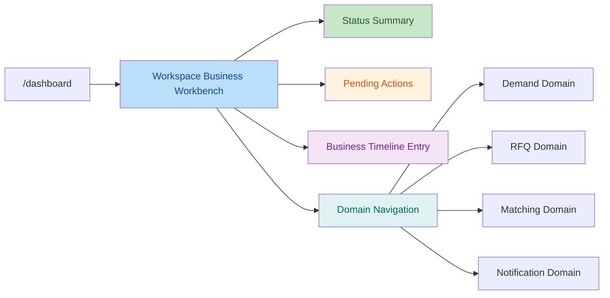

# M14.5.0 Workspace Business Workbench Architecture Planning Report

## 1. Execution Context

- Repository Root: `F:\Desktop\VISNDT`
- Code Root: `F:\Desktop\VISNDT\VISNDT`
- Branch: `main`
- Task Mode: `ONLY READ ARCHITECTURE AUDIT`
- Allowed Write Scope Used: `docs/_review/` only

本次任务仅执行代码与历史报告只读审计，未修改任何前端业务文件、后端文件、数据库文件或 API 合同。

## 2. M14.4 Completion Review

结合 `389` 至 `396` 号报告与当前源码，M14.4 已完成以下收口：

1. Workspace API Client Foundation 已建立：
   - Web 侧统一通过 `workspace.service.ts -> lib/api/workspace.ts` 访问 Workspace 聚合接口。
2. Dashboard 统一入口已建立：
   - `/dashboard` 已按 `workspaceRole` 分流到 `/dashboard/buyer` 或 `/dashboard/supplier`。
3. Buyer Dashboard 已完成：
   - 已具备 Buyer 汇总卡片、Demand Overview、Pending RFQ Response Decisions 展示能力。
4. Supplier Dashboard 已完成：
   - 已具备 Supplier 概览卡片、Targeted RFQ Snapshot、Response Tracking 展示能力。
5. Legacy Workspace 首页已收口：
   - `/workspace` 当前仅承担导航入口，不再承担 summary-style 聚合首页职责。
6. Workspace shell 边界已收口：
   - `WorkspaceSidebar.tsx` 已去除通知 unread count 的直接 API 依赖，回归纯导航 shell。

结论：M14.4 已完成 Workspace / Dashboard 第一阶段冻结目标，当前体系已经具备继续规划 M14.5 Business Workbench 的前置条件。

## 3. Workspace Positioning

### Workspace 是什么

Workspace 在 M14.5 之后应被明确定位为：

`Business Status & Navigation Center`

即：

- 角色感知入口
- 业务状态汇总面板
- 待处理事项入口
- 跨 Domain 业务导航中心
- Timeline / traceability 入口

### Workspace 不是什么

Workspace 不应承担：

- Demand 创建页
- Demand 编辑页
- Demand 发布/关闭操作页
- RFQ 创建/发布/关闭/决策操作页
- Matching 控制台
- Notification 业务处理逻辑中心
- Supplier Marketplace / Supplier Store / 全量 Demand 浏览入口

### Positioning Judgment

Workspace 的目标不是替代 Domain 页面，而是把 Domain 页面组织成统一、稳定、低耦合的工作台入口层。

## 4. Buyer Workspace Planning

### Current

#### Buyer Workspace Current Capability

当前 Buyer 侧已存在以下 Workspace 能力：

| 类型 | 当前能力 | 数据来源 |
| --- | --- | --- |
| Dashboard 概览 | Demand 总量、Match 总量、RFQ 总量、待决策响应统计 | `/workspace/buyer/overview` |
| Demand 概览 | 最近 Demand 列表、Demand 状态、matchCount、rfqCount | `/workspace/buyer/demands` |
| 待办摘要 | Pending RFQ Response Decisions | `/workspace/buyer/pending-decisions` |
| 导航入口 | Dashboard / 我的需求 / 询价单 / 匹配结果 / 通知中心 / 设置 | `WorkspaceSidebar.tsx` |
| Workspace 入口页 | 角色导航入口，不再聚合业务数据 | `/workspace` |

当前 Buyer Dashboard 展示内容已经符合“状态汇总 + 入口跳转”的基本形态，但 Buyer 业务操作仍主要落在 Domain 页：

- `/workspace/demands`
- `/workspace/demands/create`
- `/workspace/demands/[id]`
- `/workspace/rfqs`
- `/workspace/rfqs/[id]`
- `/workspace/matches`

### Future Boundary

#### Buyer Workspace Future Boundary

M14.5 建议 Buyer Workspace 允许承担以下职责：

- Demand 状态摘要
- RFQ 进度摘要
- Supplier 响应状态摘要
- Pending Actions
- Business Timeline 入口
- Domain 页面入口导航

推荐表达方式：

| 允许承载 | 说明 |
| --- | --- |
| Demand 状态摘要 | 仅展示数量、状态、最近变化，不提供编辑表单 |
| RFQ 进度摘要 | 仅展示阶段进度、响应数量、关闭状态 |
| Supplier 响应状态 | 仅展示待决策、已接受、已拒绝等状态 |
| Pending Actions | 例如“有 X 条待决策响应”“有 X 条已发布 Demand 待跟进” |
| Business Timeline 入口 | 进入独立时间线页面或后续 timeline domain 入口 |
| Domain 入口导航 | 跳转到 Demand / RFQ / Matching / Notification 的实际操作页 |

### Forbidden Responsibility

#### Buyer Workspace Forbidden Responsibility

Buyer Workspace 不应负责：

- 创建需求
- 编辑需求
- 修改需求参数
- Demand 发布/关闭
- RFQ 创建/发布/关闭
- RFQ Response 接受/拒绝
- Matching 状态修改
- Rematch 控制

原因：

这些都是 Domain Workflow 操作，不应回流到 Workspace 作为聚合层执行。

## 5. Supplier Workspace Planning

### Current

#### Supplier Workspace Current Capability

当前 Supplier 侧已存在以下 Workspace 能力：

| 类型 | 当前能力 | 数据来源 |
| --- | --- | --- |
| Dashboard 概览 | RFQ Summary / Response Summary / Notification Summary / Match Summary | `/workspace/supplier/overview` |
| Targeted RFQ Snapshot | 最近收到的定向 RFQ 快照 | `/workspace/supplier/rfqs` |
| Response Tracking | 最近提交的响应记录与 Buyer 上下文 | `/workspace/supplier/responses` |
| 导航入口 | Dashboard / Supplier Workspace / RFQ 响应 / 我的响应 / 通知中心 / 设置 | `WorkspaceSidebar.tsx` |
| Supplier Workspace Shell | 入口骨架页，不接入业务 API | `/workspace/supplier` |

同时，Supplier 真实业务操作仍位于 Domain 页面：

- `/workspace/supplier/rfqs`
- `/workspace/supplier/rfqs/[id]`
- `/workspace/supplier/responses`

其中 `/workspace/supplier/rfqs/[id]` 当前已经包含 RFQ 响应提交逻辑，证明它是明确的业务操作页，而不是 Workspace Workbench 本身。

### Future Boundary

#### Supplier Workspace Future Boundary

M14.5 建议 Supplier Workspace 允许承担以下职责：

- RFQ 机会摘要
- Response 状态摘要
- 待处理事项
- 业务入口导航
- Timeline / 业务轨迹入口

推荐表达方式：

| 允许承载 | 说明 |
| --- | --- |
| RFQ 机会摘要 | 展示定向 RFQ 数量、状态、最近更新时间 |
| Response 状态 | 展示已提交、已查看、已接受、已拒绝等汇总 |
| 待处理事项 | 例如“有 X 条 OPEN RFQ 待响应” |
| 业务入口 | 跳转到 RFQ 列表、响应记录、通知中心 |
| Timeline 入口 | 提供后续业务轨迹页面入口，而非直接承载完整流程 |

### Forbidden Responsibility

#### Supplier Workspace Forbidden Responsibility

Supplier Workspace 不应负责：

- Supplier Store
- 产品商城
- Supplier 独立商城
- 自主浏览全部 Demand
- 平台匹配算法控制
- 批量 RFQ 业务决策控制台

原因：

VISNDT 当前是 Platform Matching 模式，不是 Supplier Marketplace 模式。Supplier Workspace 的定位应是“收到什么、该响应什么、去哪里处理”，而不是“主动逛市场并主导撮合逻辑”。

## 6. Workspace API Boundary

### Current APIs

当前 Workspace Backend 已具备以下只读聚合接口：

| 角色 | Endpoint | 用途 |
| --- | --- | --- |
| Buyer | `/workspace/buyer/overview` | Buyer 总览统计 |
| Buyer | `/workspace/buyer/demands` | Buyer Demand 概览列表 |
| Buyer | `/workspace/buyer/pending-decisions` | 待处理响应决策列表 |
| Supplier | `/workspace/supplier/overview` | Supplier 总览统计 |
| Supplier | `/workspace/supplier/rfqs` | 定向 RFQ 快照列表 |
| Supplier | `/workspace/supplier/responses` | Supplier 响应跟踪列表 |

边界判断：

- 当前 API 已足够支撑 M14.4 Dashboard
- 当前 API 也基本足够支撑 M14.5 第一阶段的“状态中心 + 导航中心”
- 当前尚未看到必须立即执行的大规模 Workspace API 重构需求

### Potential Extension

对 `/workspace/buyer/actions`、`/workspace/supplier/actions` 的判断如下：

#### 当前是否必须新增

结论：`不是立即必须`

原因：

- Buyer 侧已有 `pending-decisions`，已经覆盖最明确的一类待办事项
- Buyer / Supplier overview 已提供足够的状态统计
- 现阶段 Workspace 若只承担“状态摘要 + 导航入口”，前端可以先用现有 overview/list 能力完成页面规划

#### 何时值得新增

只有在以下场景同时成立时，才建议新增小范围只读聚合接口：

- 需要统一输出“优先级排序后的 Pending Actions”
- 需要跨 Demand / RFQ / Response / Notification 生成单一动作队列
- 需要明确 CTA 文案与目标跳转，而不希望前端自行拼装跨域规则

#### 建议口径

| 候选扩展 | 是否立即需要 | 建议 |
| --- | --- | --- |
| `/workspace/buyer/actions` | 否 | Phase 2 可选，只在确实需要统一 Buyer action queue 时新增 |
| `/workspace/supplier/actions` | 否 | Phase 2 可选，只在确实需要统一 Supplier action queue 时新增 |

因此，M14.5 规划阶段建议维持：

- 先用现有 Workspace APIs 完成 Workbench 第一版
- 仅在动作队列抽象被实际页面需求证明后，再补充只读 action endpoint

## 7. Domain Boundary

| Domain | Workspace 可负责 | Workspace 不可负责 | 归属判断 |
| --- | --- | --- | --- |
| Demand Domain | 状态摘要、最近 Demand、入口导航 | 创建、编辑、发布、关闭、参数修改 | Demand 业务流必须留在 Demand Domain |
| RFQ Domain | RFQ 进度摘要、待决策摘要、定向 RFQ 快照、响应跟踪入口 | 创建 RFQ、发布 RFQ、关闭 RFQ、响应决策、提交响应 | RFQ 生命周期属于 RFQ Domain |
| Matching Domain | 匹配结果数量、状态统计、导航入口 | 更新 match 状态、重跑 rematch、撮合控制 | Matching 算法与控制权不能进入 Workspace |
| Notification Domain | 未读数摘要、通知中心入口 | 标记已读、全部已读、通知处理逻辑 | Notification 处理仍属于 Notification Domain |

边界结论：

Workspace 负责“看见、理解、进入”；
Domain 负责“执行、变更、提交”。

## 8. Backend Capability Review

### Existing Capability

当前 `apps/api/src/workspace/` 已具备：

- Buyer / Supplier 双角色只读聚合入口
- 基于 `workspaceRole + organizationId` 的后端访问约束
- Demand / RFQ / RFQResponse / Match / Notification 的状态聚合能力
- 适合 Dashboard / Workbench 场景的概览与列表接口

### Potential Gap

| Gap | Current | Priority | 说明 |
| --- | --- | --- | --- |
| Buyer 统一 Pending Actions 队列 | 缺失 | Medium | 当前只有 `pending-decisions`，尚未覆盖更广义 Buyer action queue |
| Supplier 统一 Pending Actions 队列 | 缺失 | Medium | 当前 overview + rfqs + responses 分散，尚未统一为动作清单 |
| Business Timeline 聚合接口 | 缺失 | Medium | 现有 schema 有 `WorkflowEvent`，但 Workspace 未提供 timeline 聚合能力 |
| Supplier RFQ Snapshot 的 demand context 丰富度 | 偏弱 | Low | 当前主要提供 title/reference，适合概览，不适合更深状态解释 |
| Workspace 导航级 CTA contract | 缺失 | Low | 目前前端通过静态链接组织入口，后端尚未提供可配置 CTA 数据 |

Backend 评估结论：

- 当前能力足以支撑 M14.5 第一阶段 Workbench
- 若进入第二阶段“统一待办 + timeline”建设，建议新增小范围只读接口，而不是重构现有 Workspace module

## 9. M14.5 Recommended Development Sequence

建议开发顺序如下：

1. 固化 Workspace 定位
   - 先文档冻结：Workspace = Status & Navigation Center
2. Buyer Workbench 第一版
   - 在 Buyer Dashboard 上补齐 Pending Actions 区块与 Timeline 入口
3. Supplier Workbench 第一版
   - 在 Supplier Dashboard 上补齐 Pending Actions 区块与 Timeline 入口
4. 复用现有 Workspace API 完成第一版交付
   - 不急于新增 `/actions`
5. 验证第一版页面是否出现明显前端拼装压力
   - 若有，再评估 `/workspace/buyer/actions` 与 `/workspace/supplier/actions`
6. 第二阶段再评估 Timeline 聚合接口
   - 优先考虑只读聚合，不进入 Domain 重构

推荐原则：

- 先做页面定位正确
- 再做小步增强
- 不把 Domain Workflow 回卷进 Workspace

## 10. Freeze Check

- Frontend Code Modified: `No`
- Backend Modified: `No`
- Database Modified: `No`
- API Modified: `No`
- Auth/RBAC Modified: `No`

验证说明：

- 本任务未执行 `pnpm build`
- 本任务未执行 `pnpm exec tsc --noEmit`
- 原因：本次无代码修改，仅新增规划报告

## 11. Final Status

`PASS`

本次审计结论：

- M14.4 已完成 Dashboard 统一入口、Buyer/Supplier Dashboard、Workspace API Client 与 Shell 边界收口
- M14.5 应将 Workspace 明确冻结为 `Business Status & Navigation Center`
- 后续业务操作能力必须继续留在 Demand / RFQ / Matching / Notification 等 Domain 页面中
