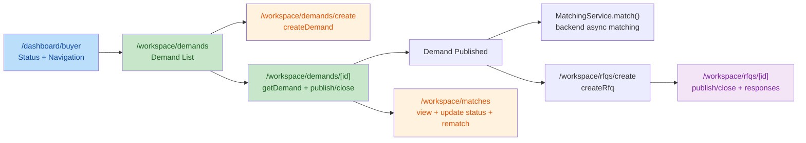
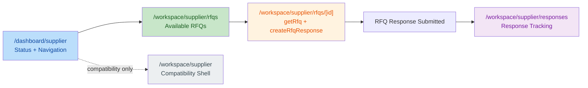

# M14.6.0 Domain Workspace Integration Architecture Audit Report

## 1. Execution Context

- Repository Root: `F:\Desktop\VISNDT`
- Code Root: `F:\Desktop\VISNDT\VISNDT`
- Branch: `main`
- Task Mode: `ONLY READ ARCHITECTURE AUDIT`
- Write Scope Used: `docs/_review/402_M14.6.0_Domain_Workspace_Integration_Architecture_Audit_Report.md` only

Environment check result:

- Repository Root matches expected path
- Code Root matches expected path
- Branch matches expected value `main`

Actual repository structure note:

- Task brief lists backend paths `apps/api/src/demand/` and `apps/api/src/rfq/`
- Current repository uses `apps/api/src/demands/` and `apps/api/src/rfqs/`
- Audit used the actual existing module paths for evidence collection

No business code, API contract, backend module, database schema, migration, Auth/RBAC logic, or UI implementation was modified in this task.

## 2. Audit Scope

Read scope used:

- Frontend routes:
  - `VISNDT/apps/web/src/app/workspace/`
  - Focused routes:
    - `/workspace`
    - `/workspace/dashboard`
    - `/workspace/demands`
    - `/workspace/demands/create`
    - `/workspace/demands/[id]`
    - `/workspace/rfqs`
    - `/workspace/rfqs/create`
    - `/workspace/rfqs/[id]`
    - `/workspace/matches`
    - `/workspace/supplier`
    - `/workspace/supplier/rfqs`
    - `/workspace/supplier/rfqs/[id]`
    - `/workspace/supplier/responses`
- Frontend services:
  - `VISNDT/apps/web/src/services/workspace.service.ts`
  - `VISNDT/apps/web/src/services/demand.service.ts`
  - `VISNDT/apps/web/src/services/rfq.service.ts`
  - `VISNDT/apps/web/src/services/match.service.ts`
- Frontend API:
  - `VISNDT/apps/web/src/lib/api/workspace.ts`
  - `VISNDT/apps/web/src/lib/api/demands.ts`
  - `VISNDT/apps/web/src/lib/api/rfqs.ts`
- Backend:
  - `VISNDT/apps/api/src/workspace/`
  - `VISNDT/apps/api/src/demands/`
  - `VISNDT/apps/api/src/rfqs/`
  - `VISNDT/apps/api/src/matching/`
- Database:
  - `VISNDT/database/prisma/schema.prisma`
- Review history:
  - `397_M14.5.0_Workspace_Business_Workbench_Architecture_Planning_Report.md`
  - `398_M14.5.1_Buyer_Workbench_Status_Enhancement_Report.md`
  - `399_M14.5.2_Supplier_Workbench_Status_Enhancement_Report.md`
  - `400_M14.5.3_Workspace_Workbench_Architecture_Validation_Report.md`
  - `401_M14.5.4_Workspace_Route_Ownership_Normalization_Report.md`

Audit baseline adopted:

- Dashboard = `Business Status & Navigation Center`
- Workspace root/shell = navigation and compatibility layer
- Domain pages = create / edit / publish / submit / close / workflow execution

## 3. Buyer Domain Flow Audit

Observed Buyer route chain:

- `/workspace/demands`
  - Lists buyer demands
  - Provides entry to `/workspace/demands/create`
- `/workspace/demands/create`
  - Calls `createDemand`
- `/workspace/demands/[id]`
  - Calls `getDemand`, `getDemandMatches`, `publishDemand`, `closeDemand`
- `/workspace/rfqs`
  - Lists buyer RFQs
  - Provides entry to `/workspace/rfqs/create`
- `/workspace/rfqs/create`
  - Loads buyer demands and calls `createRfq`
- `/workspace/rfqs/[id]`
  - Calls `getRfq`, `getRfqResponses`, `publishRfq`, `closeRfq`
- `/workspace/matches`
  - Aggregates buyer demand matches
  - Calls `updateMatchStatus` and `rematchDemand`

Buyer Domain Flow Diagram:

Assessment:

- `Demand 创建`: evidenced
- `Demand 发布`: evidenced
- `Demand 关闭`: evidenced
- `Demand -> Matching 等待`: evidenced through backend `MatchingService.match()` triggered after demand publish
- `Demand -> RFQ`: evidenced
- `RFQ -> Supplier Response`: evidenced through RFQ detail response list and supplier response submission route
- `Matching 页面是否进入 Dashboard/Workbench`: no, it remains in domain page scope

Risk finding:

- Buyer lifecycle still lacks visible `编辑` evidence in current audited route chain:
  - frontend route scope shows create + detail + publish/close
  - backend already provides `PATCH /demands/:id`
  - but current audited workspace routes do not expose `updateDemand` or an explicit edit route/entry

Judgment:

`PASS WITH RISKS`

## 4. Supplier Domain Flow Audit

Observed Supplier route chain:

- `/workspace/supplier`
  - Compatibility shell only
  - no business API usage
- `/workspace/supplier/rfqs`
  - Calls `getAvailableRfqs`
  - read-only RFQ opportunity listing
- `/workspace/supplier/rfqs/[id]`
  - Calls `getRfq`
  - submits supplier response via `createRfqResponse`
- `/workspace/supplier/responses`
  - Calls `getMyRfqResponses`
  - read-only response tracking

Supplier Domain Flow Diagram:

Assessment:

- `收到 RFQ`: evidenced via `/rfqs/available` and supplier list page
- `查看详情`: evidenced
- `提交 Response`: evidenced
- `等待 Buyer 处理`: evidenced through response tracking page and buyer pending-decision workspace aggregation
- `Supplier Marketplace / 产品商城 / 主动浏览全量 Demand / 平台外交易流程`: not found in audited supplier route scope

Judgment:

`PASS`

## 5. Workspace To Domain Route Matrix

| Entry Layer | Current Target | Observed Responsibility | Judgment |
| --- | --- | --- | --- |
| `/dashboard/buyer` | `/workspace/demands` / `/workspace/rfqs` / `/workspace/matches` | Buyer workbench routes users into buyer domain pages | PASS |
| `/dashboard/supplier` | `/workspace/supplier/rfqs` / `/workspace/supplier/responses` | Supplier workbench routes users into supplier domain pages | PASS |
| `/workspace` | Buyer links to `/dashboard/buyer`, `/workspace/demands`, `/workspace/rfqs`, `/workspace/matches` | Navigation shell behavior is consistent for buyer | PASS |
| `/workspace` | Supplier links to `/dashboard/supplier`, `/workspace/supplier`, `/workspace/supplier/rfqs`, `/workspace/supplier/responses` | Supplier still sees both dashboard and compatibility shell as peer entries | PASS WITH RISKS |
| `/workspace/dashboard` | redirects to `/dashboard` | legacy compatibility redirect remains | PASS WITH RISKS |
| `/workspace/supplier` | compatibility shell, CTA back to `/dashboard/supplier` | shell responsibility is correct | PASS |

Route-chain conclusion:

- Buyer route ownership is generally clear
- Supplier route ownership is mostly clear, but `/workspace` root page still reintroduces a parallel Supplier entry concept by labeling `/workspace/supplier` as `供应商工作台`
- Legacy route surface still exists through `/workspace/dashboard`

## 6. API Boundary Review

Workspace API Boundary Matrix:

| Layer | Route/Page | Frontend Call Path | Backend Endpoint Family | Boundary Judgment |
| --- | --- | --- | --- | --- |
| Dashboard Workbench | `/dashboard/buyer` | historical report evidence: `workspace.service.ts -> lib/api/workspace.ts` | `/workspace/buyer/*` | PASS |
| Dashboard Workbench | `/dashboard/supplier` | historical report evidence: `workspace.service.ts -> lib/api/workspace.ts` | `/workspace/supplier/*` | PASS |
| Workspace Service Layer | `workspace.service.ts` | wraps `lib/api/workspace.ts` only | `/workspace/*` | PASS |
| Buyer Domain | `/workspace/demands` | `demand.service.ts` | `/demands/*` | PASS |
| Buyer Domain | `/workspace/demands/create` | direct `lib/api/demands.ts` | `/demands` | PASS |
| Buyer Domain | `/workspace/demands/[id]` | `demand.service.ts` | `/demands/:id`, `/demands/:id/matches`, `/publish`, `/close` | PASS |
| Buyer Domain | `/workspace/rfqs` | `rfq.service.ts` | `/rfqs/mine` | PASS |
| Buyer Domain | `/workspace/rfqs/create` | direct `lib/api/demands.ts` + `lib/api/rfqs.ts` | `/demands/my`, `/rfqs` | PASS |
| Buyer Domain | `/workspace/rfqs/[id]` | `rfq.service.ts` | `/rfqs/:id`, `/rfqs/:id/responses`, `/publish`, `/close` | PASS |
| Buyer Domain | `/workspace/matches` | `match.service.ts` + direct `lib/api/demands.ts` | `/demands/:id/matches/:matchId`, `/demands/:id/rematch` | PASS |
| Supplier Domain | `/workspace/supplier/rfqs` | `rfq.service.ts` | `/rfqs/available` | PASS |
| Supplier Domain | `/workspace/supplier/rfqs/[id]` | `rfq.service.ts` | `/rfqs/:id`, `/rfqs/:id/responses` | PASS |
| Supplier Domain | `/workspace/supplier/responses` | `rfq.service.ts` | `/rfq-responses/mine` | PASS |

Workspace backend review:

- `workspace.controller.ts` exposes only `GET` endpoints:
  - `/workspace/status`
  - `/workspace/buyer/overview`
  - `/workspace/buyer/demands`
  - `/workspace/buyer/pending-decisions`
  - `/workspace/supplier/overview`
  - `/workspace/supplier/rfqs`
  - `/workspace/supplier/responses`
- No workflow mutation endpoint was found in `apps/api/src/workspace/`

Boundary conclusion:

- Dashboard/workbench side remains on `workspace.service.ts -> lib/api/workspace.ts -> /workspace/*`
- Domain pages use domain services/domain APIs
- No evidence was found that Dashboard directly calls demand/rfq/matching domain APIs

## 7. Workflow Boundary Review

Capability ownership check:

| Capability | Observed Owner | Evidence Summary | Judgment |
| --- | --- | --- | --- |
| Demand create | Demand domain page | `/workspace/demands/create` -> `createDemand` | PASS |
| Demand publish | Demand domain page | `/workspace/demands/[id]` -> `publishDemand`; backend `POST /demands/:id/publish` | PASS |
| Demand close | Demand domain page | `/workspace/demands/[id]` -> `closeDemand`; backend `POST /demands/:id/close` | PASS |
| Demand edit | backend capability exists, current audited frontend route not evidenced | backend `PATCH /demands/:id` exists; frontend audited routes do not expose visible edit path | PASS WITH RISKS |
| RFQ create | RFQ domain page | `/workspace/rfqs/create` -> `createRfq` | PASS |
| RFQ publish | RFQ domain page | `/workspace/rfqs/[id]` -> `publishRfq`; backend `POST /rfqs/:id/publish` | PASS |
| RFQ close | RFQ domain page | `/workspace/rfqs/[id]` -> `closeRfq`; backend `POST /rfqs/:id/close` | PASS |
| RFQ Response submit | Supplier domain page | `/workspace/supplier/rfqs/[id]` -> `createRfqResponse` | PASS |
| RFQ Response update | not evidenced in current audited route scope | supplier responses page is tracking-only | PASS WITH RISKS |
| Matching rematch | Matching domain page | `/workspace/matches` -> `rematchDemand`; backend `POST /demands/:id/rematch` | PASS |
| Matching status update | Matching domain page | `/workspace/matches` -> `updateMatchStatus`; backend `PATCH /demands/:id/matches/:matchId` | PASS |

Workflow boundary conclusion:

- Workflow mutations stay in domain pages and domain controllers
- Workflow did not leak into Dashboard/workbench pages
- The main current gap is not leakage, but lifecycle completeness and route-language consistency

## 8. Architecture Risks

### High

No High risk was confirmed in the audited scope.

### Medium

1. Supplier route ownership wording regressed at `/workspace`
   - `/workspace/supplier` was normalized in task `401` as compatibility shell only
   - but `/workspace/page.tsx` still exposes it as `供应商工作台`
   - impact:
     - reintroduces dual-entry mental model
     - weakens `/dashboard/supplier` as the canonical workbench
     - increases chance of future scope drifting back into compatibility shell

2. Buyer Demand lifecycle lacks visible edit evidence in current route chain
   - current route scope clearly supports create, view, publish, close
   - backend update capability exists
   - but audited frontend routes do not currently evidence the `edit` step
   - impact:
     - Buyer Domain lifecycle is not fully expressed as `创建 -> 编辑 -> 发布 -> 匹配等待`

### Low

1. Legacy route surface remains at `/workspace/dashboard`
   - current behavior is only redirect to `/dashboard`
   - low operational risk
   - still counts as retained legacy entry surface in route inventory

## 9. M14.6 Recommendation

Recommendation:

`可以进入 M14.6.1 Buyer Domain Flow Validation，但应按 PASS WITH RISKS 进入。`

Suggested validation priorities for M14.6.1:

1. 先确认 Buyer Demand `编辑`链路是否应显式纳入当前 Domain flow
2. 先修正文档/入口表达上的 Supplier canonical route 口径，避免 `/workspace` 根入口继续将 compatibility shell 表述为正式工作台
3. 继续保持 Dashboard 只读聚合边界，不把 workflow mutation 回卷进 `/dashboard/*`

## 10. Final Status

`PASS WITH RISKS`

Final conclusion:

- Workspace Workbench 与 Domain 页面之间的 API 边界总体正确
- Dashboard 仍是状态理解与导航入口，不承担 domain workflow mutation
- Buyer/Supplier domain pages 已承接主要业务流动作
- 当前主要问题不在 API 越界，而在：
  - Supplier route ownership 表达仍有残余冲突
  - Buyer Demand 生命周期的 `编辑`步骤在当前前端 route chain 中未被证实
