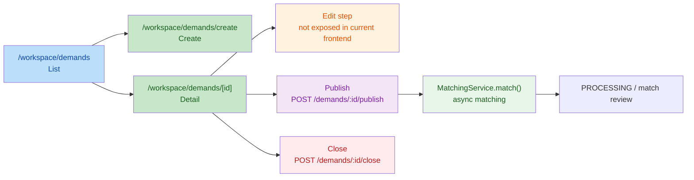

# 404_M14.6.1.2_Buyer_Demand_Edit_Flow_Validation_Report

## 1. Execution Context

- Repository Root: `F:\Desktop\VISNDT`
- Code Root: `F:\Desktop\VISNDT\VISNDT`
- Branch: `main`
- Task Mode: `ONLY READ ARCHITECTURE VALIDATION`
- Write Scope Used: `docs/_review/404_M14.6.1.2_Buyer_Demand_Edit_Flow_Validation_Report.md` only

Pre-check result:

- Repository Root matches task requirement
- Code Root matches task requirement
- Current branch matches task requirement: `main`
- Task executed in read-only audit mode

Constraint confirmation:

- No frontend business code modified
- No backend code modified
- No DTO modified
- No database/schema modified
- No API contract modified
- `pnpm build` not executed by instruction
- `pnpm exec tsc --noEmit` not executed by instruction

## 2. Audit Scope

Read scope used:

- Frontend routes
  - [apps/web/src/app/workspace/demands/page.tsx](file:///F:/Desktop/VISNDT/VISNDT/apps/web/src/app/workspace/demands/page.tsx)
  - [apps/web/src/app/workspace/demands/create/page.tsx](file:///F:/Desktop/VISNDT/VISNDT/apps/web/src/app/workspace/demands/create/page.tsx)
  - [apps/web/src/app/workspace/demands/[id]/page.tsx](file:///F:/Desktop/VISNDT/VISNDT/apps/web/src/app/workspace/demands/%5Bid%5D/page.tsx)
- Frontend components
  - [apps/web/src/components/demand/DemandList.tsx](file:///F:/Desktop/VISNDT/VISNDT/apps/web/src/components/demand/DemandList.tsx)
  - [apps/web/src/components/demand/DemandDetail.tsx](file:///F:/Desktop/VISNDT/VISNDT/apps/web/src/components/demand/DemandDetail.tsx)
  - [apps/web/src/components/workspace/DemandCard.tsx](file:///F:/Desktop/VISNDT/VISNDT/apps/web/src/components/workspace/DemandCard.tsx)
- Frontend service / API
  - [apps/web/src/services/demand.service.ts](file:///F:/Desktop/VISNDT/VISNDT/apps/web/src/services/demand.service.ts)
  - [apps/web/src/lib/api/demands.ts](file:///F:/Desktop/VISNDT/VISNDT/apps/web/src/lib/api/demands.ts)
- Backend
  - [apps/api/src/demands/demands.controller.ts](file:///F:/Desktop/VISNDT/VISNDT/apps/api/src/demands/demands.controller.ts)
  - [apps/api/src/demands/demands.service.ts](file:///F:/Desktop/VISNDT/VISNDT/apps/api/src/demands/demands.service.ts)
  - [apps/api/src/demands/dto/create-demand.dto.ts](file:///F:/Desktop/VISNDT/VISNDT/apps/api/src/demands/dto/create-demand.dto.ts)
  - [apps/api/src/demands/dto/update-demand.dto.ts](file:///F:/Desktop/VISNDT/VISNDT/apps/api/src/demands/dto/update-demand.dto.ts)
- Database
  - [database/prisma/schema.prisma](file:///F:/Desktop/VISNDT/VISNDT/database/prisma/schema.prisma)
- Review history
  - `397_M14.5.0_Workspace_Business_Workbench_Architecture_Planning_Report.md`
  - `398_M14.5.1_Buyer_Workbench_Status_Enhancement_Report.md`
  - `400_M14.5.3_Workspace_Workbench_Architecture_Validation_Report.md`
  - `402_M14.6.0_Domain_Workspace_Integration_Architecture_Audit_Report.md`

## 3. Current Buyer Demand Lifecycle

Observed frontend route chain and backend lifecycle markers show the following current state:

Lifecycle completeness assessment against target model `Create -> Edit -> Publish -> Matching -> Close`:

| Step | Current Evidence | Result |
| --- | --- | --- |
| Create | `/workspace/demands/create` calls `createDemand` | Present |
| Edit | No route, no button, no page-level `updateDemand` call | Missing in frontend chain |
| Publish | Demand detail page exposes publish action | Present |
| Matching | Publish triggers backend matching asynchronously | Present |
| Close | Demand detail page exposes close action | Present |

Conclusion:

- Current Buyer Demand lifecycle is **not complete** at the frontend route-expression level.
- Missing step is specifically `Edit`.

## 4. Frontend Capability Review

### 4.1 Route Audit

Confirmed route capability:

- Demand list page provides only `Create` entry:
  - [demands/page.tsx:L53-L65](file:///F:/Desktop/VISNDT/VISNDT/apps/web/src/app/workspace/demands/page.tsx#L53-L65)
- Demand list items navigate only to detail page:
  - [DemandList.tsx:L46-L50](file:///F:/Desktop/VISNDT/VISNDT/apps/web/src/components/demand/DemandList.tsx#L46-L50)
- Workspace demand card also links only to detail page:
  - [DemandCard.tsx:L25-L28](file:///F:/Desktop/VISNDT/VISNDT/apps/web/src/components/workspace/DemandCard.tsx#L25-L28)
- Demand detail page provides only `Publish` and `Close` actions:
  - [demands/[id]/page.tsx:L54-L79](file:///F:/Desktop/VISNDT/VISNDT/apps/web/src/app/workspace/demands/%5Bid%5D/page.tsx#L54-L79)
  - [demands/[id]/page.tsx:L108-L131](file:///F:/Desktop/VISNDT/VISNDT/apps/web/src/app/workspace/demands/%5Bid%5D/page.tsx#L108-L131)

Not found:

- `/workspace/demands/[id]/edit`
- any dedicated edit route under `apps/web/src/app/workspace/demands/`
- any edit button on list page, card component, or detail page

### 4.2 Frontend Service Audit

Observed facts:

- API client already defines `updateDemand(id, params)` using `PATCH /demands/:id`:
  - [lib/api/demands.ts:L78-L91](file:///F:/Desktop/VISNDT/VISNDT/apps/web/src/lib/api/demands.ts#L78-L91)
- Demand service layer does **not** export `updateDemand`; it exports only list/detail/delete/publish/close/matches:
  - [services/demand.service.ts:L8-L31](file:///F:/Desktop/VISNDT/VISNDT/apps/web/src/services/demand.service.ts#L8-L31)
- Global search found no page/component call site for `updateDemand`

Frontend capability judgment:

- `updateDemand` exists only at API-wrapper level
- It is **not connected** to the route/page/service chain
- Current frontend does **not** provide a usable Buyer Demand edit capability

### 4.3 Historical Boundary Cross-check

Historical reports `397`, `400`, `402` consistently state:

- `/dashboard/*` is `Status + Navigation`
- Domain workflow actions must remain in domain pages

Therefore:

- `Dashboard/Workbench` should not own edit
- but this does **not** prove that Demand Domain itself should keep edit disabled

## 5. Backend Capability Review

### 5.1 Controller Capability

Backend explicitly provides `PATCH /demands/:id`:

- [demands.controller.ts:L86-L100](file:///F:/Desktop/VISNDT/VISNDT/apps/api/src/demands/demands.controller.ts#L86-L100)

This confirms the answer to validation question 2:

- `PATCH /demands/:id` exists: **Yes**

### 5.2 Service Capability

Backend service implements update with the following behavior:

- ownership/org validation:
  - [demands.service.ts:L252-L267](file:///F:/Desktop/VISNDT/VISNDT/apps/api/src/demands/demands.service.ts#L252-L267)
- terminal-state guard:
  - [demands.service.ts:L268-L272](file:///F:/Desktop/VISNDT/VISNDT/apps/api/src/demands/demands.service.ts#L268-L272)
- mutable fields include title/description/budget/quantity/date/contact info:
  - [demands.service.ts:L274-L289](file:///F:/Desktop/VISNDT/VISNDT/apps/api/src/demands/demands.service.ts#L274-L289)

### 5.3 Lifecycle Alignment Review

Important observation:

- `UpdateDemandDto` includes `status`
  - [update-demand.dto.ts:L16-L19](file:///F:/Desktop/VISNDT/VISNDT/apps/api/src/demands/dto/update-demand.dto.ts#L16-L19)
- `service.update()` writes `status` directly
  - [demands.service.ts:L276-L288](file:///F:/Desktop/VISNDT/VISNDT/apps/api/src/demands/demands.service.ts#L276-L288)
- but dedicated lifecycle transitions already exist for publish/close:
  - [demands.controller.ts:L116-L145](file:///F:/Desktop/VISNDT/VISNDT/apps/api/src/demands/demands.controller.ts#L116-L145)
- publish/close create workflow events, while generic update does not:
  - created: [demands.service.ts:L232-L236](file:///F:/Desktop/VISNDT/VISNDT/apps/api/src/demands/demands.service.ts#L232-L236)
  - publish: [demands.service.ts:L322-L353](file:///F:/Desktop/VISNDT/VISNDT/apps/api/src/demands/demands.service.ts#L322-L353)
  - close: [demands.service.ts:L390-L445](file:///F:/Desktop/VISNDT/VISNDT/apps/api/src/demands/demands.service.ts#L390-L445)

Backend judgment:

- Backend has real edit capability
- But the generic PATCH contract is **broader than a pure pre-publish edit contract**
- It looks like an available backend mutation surface, not a fully normalized lifecycle-specific edit flow

## 6. Database Capability Review

Schema evidence:

- `DemandStatus` supports `DRAFT`, `PUBLISHED`, `SUBMITTED`, `PROCESSING`, `CLOSED`, `CANCELLED`
  - [schema.prisma:L53-L60](file:///F:/Desktop/VISNDT/VISNDT/database/prisma/schema.prisma#L53-L60)
- Demand model contains mutable business fields plus `updatedAt`
  - [schema.prisma:L463-L500](file:///F:/Desktop/VISNDT/VISNDT/database/prisma/schema.prisma#L463-L500)
- Demand model also contains lifecycle timestamps:
  - `publishedAt`
  - `closedAt`
  - `closeReason`

Database judgment:

- Database model supports an edit lifecycle
- No schema-level blocker was found
- No evidence suggests the database intentionally forbids editing before publish

## 7. Gap Analysis

### 7.1 Validation Answers

1. Current Buyer Demand lifecycle complete?
   - **No**
   - Frontend currently expresses: `Create -> View/Detail -> Publish -> Matching -> Close`
   - `Edit` is not expressed in the route/action chain

2. Backend `PATCH /demands/:id` exists?
   - **Yes**

3. Frontend has edit route / edit button / updateDemand call?
   - **No**
   - route: not found
   - button: not found
   - page/service call: not found

### 7.2 Cause Classification

For the missing frontend edit flow, the best-fit classification is:

- **A. 业务遗漏，需要未来补齐**

Reasoning:

- historical boundary only forbids moving edit into `Dashboard/Workbench`
- current Domain route chain already owns create/publish/close
- API client and backend PATCH already exist
- no evidence was found that Buyer Demand edit is intentionally disabled at Domain level

For the backend PATCH shape itself, there is also a secondary legacy characteristic:

- **C. 后端遗留能力，不属于当前流程** partially applies to the current generic PATCH contract

Reasoning:

- generic PATCH allows direct `status` mutation
- generic update does not emit workflow events
- publish/close already have dedicated lifecycle endpoints

So the combined architecture judgment is:

- **Frontend gap = A (business omission)**
- **Backend PATCH contract shape = partly C (legacy/general-purpose mutation surface)**
- **B (current design intentionally disabled) is not supported by evidence**

## 8. Recommendation

Recommendation:

- **Implement Edit**

Reason:

- Buyer Demand lifecycle is currently incomplete without `Edit`
- Existing architecture places workflow actions in Demand Domain pages, not in Dashboard
- Backend and database already provide enough baseline capability to justify completing the domain route chain

Implementation boundary recommendation for future work:

- Edit must remain under Demand Domain, not `/dashboard/*`
- Edit should be added as a domain-page capability under the existing `/workspace/demands/*` ownership
- Future implementation should treat `publish` and `close` as dedicated lifecycle actions, not as generic PATCH status updates

## 9. Freeze Check

- Frontend Business Code Modified: `No`
- Backend Modified: `No`
- DTO Modified: `No`
- Database Modified: `No`
- API Modified: `No`
- Auth/RBAC Modified: `No`
- Matching Algorithm Modified: `No`
- Frozen module violation: `No`

Verification note:

- This task only generated the review report
- No route was added
- No API was added
- No DTO was changed
- No schema was changed

## 10. Final Status

`PASS WITH RISKS`

Final conclusion:

- Buyer Demand lifecycle is **not fully complete** in the current frontend route chain
- Missing step is `Edit`
- Backend `PATCH /demands/:id` exists and database supports editing
- Current absence of frontend edit capability is best understood as a **domain-flow omission to be completed later**, not as an intentional long-term disablement
