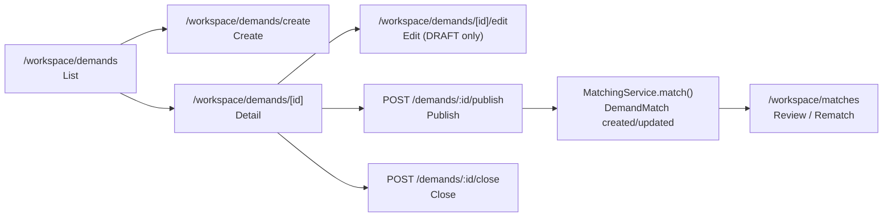
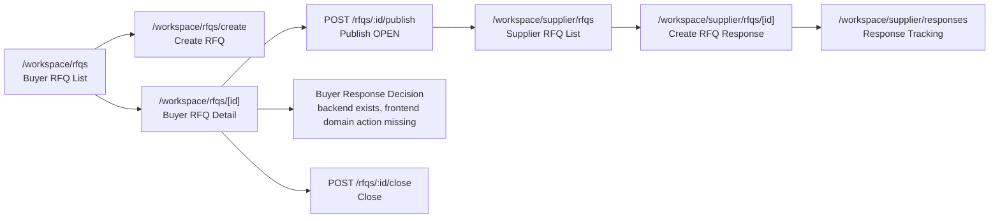

# 406 M14.6.2.0 Domain Workflow Boundary Review Report

## 1. Execution Context

- Task ID: `406_M14.6.2.0_Domain_Workflow_Boundary_Review`
- Task Name: `Domain Workflow Boundary Review`
- Repository Root: `F:\Desktop\VISNDT`
- Code Root: `F:\Desktop\VISNDT\VISNDT`
- Branch: `main`
- Task Mode: `ONLY READ ARCHITECTURE AUDIT`

Pre-check result:

- Repository Root matches expected path
- Code Root matches expected path
- Branch matches expected value `main`

Read-before-audit reports:

- [397_M14.5.0_Workspace_Business_Workbench_Architecture_Planning_Report.md](file:///F:/Desktop/VISNDT/docs/_review/397_M14.5.0_Workspace_Business_Workbench_Architecture_Planning_Report.md)
- [400_M14.5.3_Workspace_Workbench_Architecture_Validation_Report.md](file:///F:/Desktop/VISNDT/docs/_review/400_M14.5.3_Workspace_Workbench_Architecture_Validation_Report.md)
- [402_M14.6.0_Domain_Workspace_Integration_Architecture_Audit_Report.md](file:///F:/Desktop/VISNDT/docs/_review/402_M14.6.0_Domain_Workspace_Integration_Architecture_Audit_Report.md)
- [404_M14.6.1.2_Buyer_Demand_Edit_Flow_Validation_Report.md](file:///F:/Desktop/VISNDT/docs/_review/404_M14.6.1.2_Buyer_Demand_Edit_Flow_Validation_Report.md)
- [405_M14.6.1.3_Buyer_Demand_Edit_Domain_Flow_Implementation_Report.md](file:///F:/Desktop/VISNDT/docs/_review/405_M14.6.1.3_Buyer_Demand_Edit_Domain_Flow_Implementation_Report.md)

Adopted architecture baseline:

- Dashboard = `Status + Navigation`
- Workspace = `Navigation Layer / Compatibility Layer`
- Domain Pages = `Create / Edit / Publish / Submit / Close / Workflow Mutation`

## 2. Audit Scope

Frontend:

- [apps/web/src/app/dashboard/buyer/page.tsx](file:///F:/Desktop/VISNDT/VISNDT/apps/web/src/app/dashboard/buyer/page.tsx#L1-L220)
- [apps/web/src/app/dashboard/supplier/page.tsx](file:///F:/Desktop/VISNDT/VISNDT/apps/web/src/app/dashboard/supplier/page.tsx#L1-L220)
- [apps/web/src/app/workspace/demands/page.tsx](file:///F:/Desktop/VISNDT/VISNDT/apps/web/src/app/workspace/demands/page.tsx#L1-L147)
- [apps/web/src/app/workspace/demands/create/page.tsx](file:///F:/Desktop/VISNDT/VISNDT/apps/web/src/app/workspace/demands/create/page.tsx#L1-L220)
- [apps/web/src/app/workspace/demands/[id]/page.tsx](file:///F:/Desktop/VISNDT/VISNDT/apps/web/src/app/workspace/demands/%5Bid%5D/page.tsx#L1-L164)
- [apps/web/src/app/workspace/demands/[id]/edit/page.tsx](file:///F:/Desktop/VISNDT/VISNDT/apps/web/src/app/workspace/demands/%5Bid%5D/edit/page.tsx#L1-L220)
- [apps/web/src/app/workspace/rfqs/page.tsx](file:///F:/Desktop/VISNDT/VISNDT/apps/web/src/app/workspace/rfqs/page.tsx#L1-L147)
- [apps/web/src/app/workspace/rfqs/create/page.tsx](file:///F:/Desktop/VISNDT/VISNDT/apps/web/src/app/workspace/rfqs/create/page.tsx#L1-L220)
- [apps/web/src/app/workspace/rfqs/[id]/page.tsx](file:///F:/Desktop/VISNDT/VISNDT/apps/web/src/app/workspace/rfqs/%5Bid%5D/page.tsx#L1-L162)
- [apps/web/src/app/workspace/matches/page.tsx](file:///F:/Desktop/VISNDT/VISNDT/apps/web/src/app/workspace/matches/page.tsx#L1-L174)
- [apps/web/src/app/workspace/supplier/rfqs/page.tsx](file:///F:/Desktop/VISNDT/VISNDT/apps/web/src/app/workspace/supplier/rfqs/page.tsx#L1-L160)
- [apps/web/src/app/workspace/supplier/rfqs/[id]/page.tsx](file:///F:/Desktop/VISNDT/VISNDT/apps/web/src/app/workspace/supplier/rfqs/%5Bid%5D/page.tsx#L1-L529)
- [apps/web/src/app/workspace/supplier/responses/page.tsx](file:///F:/Desktop/VISNDT/VISNDT/apps/web/src/app/workspace/supplier/responses/page.tsx#L1-L184)
- [apps/web/src/services/workspace.service.ts](file:///F:/Desktop/VISNDT/VISNDT/apps/web/src/services/workspace.service.ts)
- [apps/web/src/services/demand.service.ts](file:///F:/Desktop/VISNDT/VISNDT/apps/web/src/services/demand.service.ts)
- [apps/web/src/services/rfq.service.ts](file:///F:/Desktop/VISNDT/VISNDT/apps/web/src/services/rfq.service.ts)
- [apps/web/src/services/match.service.ts](file:///F:/Desktop/VISNDT/VISNDT/apps/web/src/services/match.service.ts)
- [apps/web/src/lib/api/demands.ts](file:///F:/Desktop/VISNDT/VISNDT/apps/web/src/lib/api/demands.ts#L1-L180)
- [apps/web/src/lib/api/rfqs.ts](file:///F:/Desktop/VISNDT/VISNDT/apps/web/src/lib/api/rfqs.ts#L1-L231)

Backend:

- [apps/api/src/demands/demands.controller.ts](file:///F:/Desktop/VISNDT/VISNDT/apps/api/src/demands/demands.controller.ts#L70-L150)
- [apps/api/src/demands/demands.controller.ts](file:///F:/Desktop/VISNDT/VISNDT/apps/api/src/demands/demands.controller.ts#L247-L279)
- [apps/api/src/demands/demands.service.ts](file:///F:/Desktop/VISNDT/VISNDT/apps/api/src/demands/demands.service.ts#L205-L239)
- [apps/api/src/demands/demands.service.ts](file:///F:/Desktop/VISNDT/VISNDT/apps/api/src/demands/demands.service.ts#L252-L289)
- [apps/api/src/demands/demands.service.ts](file:///F:/Desktop/VISNDT/VISNDT/apps/api/src/demands/demands.service.ts#L322-L445)
- [apps/api/src/demands/dto/update-demand.dto.ts](file:///F:/Desktop/VISNDT/VISNDT/apps/api/src/demands/dto/update-demand.dto.ts)
- [apps/api/src/rfqs/rfqs.controller.ts](file:///F:/Desktop/VISNDT/VISNDT/apps/api/src/rfqs/rfqs.controller.ts#L73-L130)
- [apps/api/src/rfqs/rfqs.service.ts](file:///F:/Desktop/VISNDT/VISNDT/apps/api/src/rfqs/rfqs.service.ts#L132-L164)
- [apps/api/src/rfqs/rfqs.service.ts](file:///F:/Desktop/VISNDT/VISNDT/apps/api/src/rfqs/rfqs.service.ts#L229-L265)
- [apps/api/src/rfqs/rfqs.service.ts](file:///F:/Desktop/VISNDT/VISNDT/apps/api/src/rfqs/rfqs.service.ts#L271-L322)
- [apps/api/src/rfqs/rfqs.service.ts](file:///F:/Desktop/VISNDT/VISNDT/apps/api/src/rfqs/rfqs.service.ts#L390-L475)
- [apps/api/src/rfqs/dto/update-rfq.dto.ts](file:///F:/Desktop/VISNDT/VISNDT/apps/api/src/rfqs/dto/update-rfq.dto.ts)
- [apps/api/src/rfq-responses/rfq-responses.controller.ts](file:///F:/Desktop/VISNDT/VISNDT/apps/api/src/rfq-responses/rfq-responses.controller.ts#L18-L111)
- [apps/api/src/rfq-responses/rfq-responses.service.ts](file:///F:/Desktop/VISNDT/VISNDT/apps/api/src/rfq-responses/rfq-responses.service.ts#L128-L380)
- [apps/api/src/rfq-responses/rfq-responses.service.ts](file:///F:/Desktop/VISNDT/VISNDT/apps/api/src/rfq-responses/rfq-responses.service.ts#L439-L492)
- [apps/api/src/rfq-responses/dto/update-rfq-response.dto.ts](file:///F:/Desktop/VISNDT/VISNDT/apps/api/src/rfq-responses/dto/update-rfq-response.dto.ts)
- [apps/api/src/matching/matching.service.ts](file:///F:/Desktop/VISNDT/VISNDT/apps/api/src/matching/matching.service.ts#L23-L216)
- [apps/api/src/matching/matching.service.ts](file:///F:/Desktop/VISNDT/VISNDT/apps/api/src/matching/matching.service.ts#L218-L383)
- [apps/api/src/workspace/workspace.controller.ts](file:///F:/Desktop/VISNDT/VISNDT/apps/api/src/workspace/workspace.controller.ts)
- [apps/api/src/workspace/workspace.service.ts](file:///F:/Desktop/VISNDT/VISNDT/apps/api/src/workspace/workspace.service.ts#L1-L120)
- [apps/api/src/workspace/workspace.service.ts](file:///F:/Desktop/VISNDT/VISNDT/apps/api/src/workspace/workspace.service.ts#L183-L240)
- [apps/api/src/workspace/workspace.service.ts](file:///F:/Desktop/VISNDT/VISNDT/apps/api/src/workspace/workspace.service.ts#L264-L340)
- [apps/api/src/workspace/workspace.service.ts](file:///F:/Desktop/VISNDT/VISNDT/apps/api/src/workspace/workspace.service.ts#L386-L430)

Database:

- [database/prisma/schema.prisma](file:///F:/Desktop/VISNDT/VISNDT/database/prisma/schema.prisma#L53-L95)
- [database/prisma/schema.prisma](file:///F:/Desktop/VISNDT/VISNDT/database/prisma/schema.prisma#L463-L647)

## 3. Demand Workflow Audit

Demand lifecycle diagram:

Evidence:

1. Create exists
   - Route create entry: [demands/page.tsx:L53-L65](file:///F:/Desktop/VISNDT/VISNDT/apps/web/src/app/workspace/demands/page.tsx#L53-L65)
   - Create page mutation: [demands/create/page.tsx:L39-L52](file:///F:/Desktop/VISNDT/VISNDT/apps/web/src/app/workspace/demands/create/page.tsx#L39-L52)
   - Backend create endpoint: [demands.controller.ts:L75-L84](file:///F:/Desktop/VISNDT/VISNDT/apps/api/src/demands/demands.controller.ts#L75-L84)
   - Backend create event: [demands.service.ts:L215-L236](file:///F:/Desktop/VISNDT/VISNDT/apps/api/src/demands/demands.service.ts#L215-L236)

2. Edit exists and is restricted to DRAFT
   - Detail page `Edit` only when `status === 'DRAFT'`: [demands/[id]/page.tsx:L78-L138](file:///F:/Desktop/VISNDT/VISNDT/apps/web/src/app/workspace/demands/%5Bid%5D/page.tsx#L78-L138)
   - Edit page route and submit path: [demands/[id]/edit/page.tsx:L81-L104](file:///F:/Desktop/VISNDT/VISNDT/apps/web/src/app/workspace/demands/%5Bid%5D/edit/page.tsx#L81-L104)
   - Non-DRAFT boundary guard: [demands/[id]/edit/page.tsx:L192-L209](file:///F:/Desktop/VISNDT/VISNDT/apps/web/src/app/workspace/demands/%5Bid%5D/edit/page.tsx#L192-L209)

3. Publish exists and produces WorkflowEvent
   - Frontend publish action: [demands/[id]/page.tsx:L54-L80](file:///F:/Desktop/VISNDT/VISNDT/apps/web/src/app/workspace/demands/%5Bid%5D/page.tsx#L54-L80)
   - Backend endpoint: [demands.controller.ts:L116-L129](file:///F:/Desktop/VISNDT/VISNDT/apps/api/src/demands/demands.controller.ts#L116-L129)
   - Status change + event: [demands.service.ts:L322-L342](file:///F:/Desktop/VISNDT/VISNDT/apps/api/src/demands/demands.service.ts#L322-L342)

4. Matching is connected after publish
   - Publish triggers async matching: [demands.service.ts:L347-L351](file:///F:/Desktop/VISNDT/VISNDT/apps/api/src/demands/demands.service.ts#L347-L351)
   - Matching writes `DemandMatch` records: [matching.service.ts:L175-L203](file:///F:/Desktop/VISNDT/VISNDT/apps/api/src/matching/matching.service.ts#L175-L203)
   - Buyer match page exists with mutation controls: [matches/page.tsx:L61-L82](file:///F:/Desktop/VISNDT/VISNDT/apps/web/src/app/workspace/matches/page.tsx#L61-L82)

5. Close exists and produces WorkflowEvent
   - Frontend close action: [demands/[id]/page.tsx:L78-L136](file:///F:/Desktop/VISNDT/VISNDT/apps/web/src/app/workspace/demands/%5Bid%5D/page.tsx#L78-L136)
   - Backend endpoint: [demands.controller.ts:L131-L145](file:///F:/Desktop/VISNDT/VISNDT/apps/api/src/demands/demands.controller.ts#L131-L145)
   - Close event and auto-close linked RFQs: [demands.service.ts:L390-L439](file:///F:/Desktop/VISNDT/VISNDT/apps/api/src/demands/demands.service.ts#L390-L439)

Judgment:

`PASS WITH RISKS`

Reason:

- Demand domain route-expression is now complete after 405.
- Publish, matching, close are connected.
- Remaining risk is backend legacy mutation surface: [PATCH /demands/:id](file:///F:/Desktop/VISNDT/VISNDT/apps/api/src/demands/demands.controller.ts#L86-L100) still allows direct `status` write through [UpdateDemandDto.status](file:///F:/Desktop/VISNDT/VISNDT/apps/api/src/demands/dto/update-demand.dto.ts#L14-L18) and [demands.service.ts:L274-L289](file:///F:/Desktop/VISNDT/VISNDT/apps/api/src/demands/demands.service.ts#L274-L289).

## 4. RFQ Workflow Audit

RFQ lifecycle diagram:

Evidence:

1. RFQ Create exists
   - Buyer list create entry: [rfqs/page.tsx:L53-L65](file:///F:/Desktop/VISNDT/VISNDT/apps/web/src/app/workspace/rfqs/page.tsx#L53-L65)
   - RFQ create page: [rfqs/create/page.tsx:L32-L58](file:///F:/Desktop/VISNDT/VISNDT/apps/web/src/app/workspace/rfqs/create/page.tsx#L32-L58)
   - Current frontend uses legacy endpoint `POST /rfqs`: [rfqs/create/page.tsx:L43-L48](file:///F:/Desktop/VISNDT/VISNDT/apps/web/src/app/workspace/rfqs/create/page.tsx#L43-L48), [lib/api/rfqs.ts:L120-L130](file:///F:/Desktop/VISNDT/VISNDT/apps/web/src/lib/api/rfqs.ts#L120-L130)
   - Backend labels it `legacy migration endpoint`: [rfqs.controller.ts:L80-L89](file:///F:/Desktop/VISNDT/VISNDT/apps/api/src/rfqs/rfqs.controller.ts#L80-L89)

2. RFQ Publish exists
   - Buyer detail publish action: [rfqs/[id]/page.tsx:L55-L80](file:///F:/Desktop/VISNDT/VISNDT/apps/web/src/app/workspace/rfqs/%5Bid%5D/page.tsx#L55-L80)
   - Publish endpoint: [rfqs.controller.ts:L126-L130](file:///F:/Desktop/VISNDT/VISNDT/apps/api/src/rfqs/rfqs.controller.ts#L126-L130)
   - Publish event: [rfqs.service.ts:L396-L415](file:///F:/Desktop/VISNDT/VISNDT/apps/api/src/rfqs/rfqs.service.ts#L396-L415)

3. Supplier can view RFQ
   - Supplier RFQ list: [supplier/rfqs/page.tsx:L37-L55](file:///F:/Desktop/VISNDT/VISNDT/apps/web/src/app/workspace/supplier/rfqs/page.tsx#L37-L55)
   - Supplier RFQ detail route: [supplier/rfqs/page.tsx:L126-L133](file:///F:/Desktop/VISNDT/VISNDT/apps/web/src/app/workspace/supplier/rfqs/page.tsx#L126-L133)

4. Supplier can create RFQ Response
   - Supplier detail submit action: [supplier/rfqs/[id]/page.tsx:L120-L144](file:///F:/Desktop/VISNDT/VISNDT/apps/web/src/app/workspace/supplier/rfqs/%5Bid%5D/page.tsx#L120-L144)
   - Submit form and button: [supplier/rfqs/[id]/page.tsx:L347-L505](file:///F:/Desktop/VISNDT/VISNDT/apps/web/src/app/workspace/supplier/rfqs/%5Bid%5D/page.tsx#L347-L505)
   - Backend response create endpoint: [rfq-responses.controller.ts:L25-L36](file:///F:/Desktop/VISNDT/VISNDT/apps/api/src/rfq-responses/rfq-responses.controller.ts#L25-L36)

5. RFQResponse states exist, but are narrower than target audit expectation
   - Enum includes `SUBMITTED`, `VIEWED`, `ACCEPTED`, `REJECTED`: [schema.prisma:L70-L75](file:///F:/Desktop/VISNDT/VISNDT/database/prisma/schema.prisma#L70-L75)
   - Transition rules: [rfq-responses.service.ts:L26-L31](file:///F:/Desktop/VISNDT/VISNDT/apps/api/src/rfq-responses/rfq-responses.service.ts#L26-L31)
   - `WITHDRAWN` does not exist in current schema

6. Buyer can process Response in backend, but frontend domain page does not expose it
   - Backend decision endpoints exist: [rfq-responses.controller.ts:L60-L98](file:///F:/Desktop/VISNDT/VISNDT/apps/api/src/rfq-responses/rfq-responses.controller.ts#L60-L98)
   - Backend decision flow enforces buyer access and transitions: [rfq-responses.service.ts:L332-L380](file:///F:/Desktop/VISNDT/VISNDT/apps/api/src/rfq-responses/rfq-responses.service.ts#L332-L380)
   - Buyer detail page only renders publish / close and a response list: [rfqs/[id]/page.tsx:L109-L138](file:///F:/Desktop/VISNDT/VISNDT/apps/web/src/app/workspace/rfqs/%5Bid%5D/page.tsx#L109-L138)
   - Frontend RFQ API client exposes response list/create, but no `view/accept/reject` wrappers: [lib/api/rfqs.ts:L182-L231](file:///F:/Desktop/VISNDT/VISNDT/apps/web/src/lib/api/rfqs.ts#L182-L231)

Judgment:

`PASS WITH RISKS`

Reason:

- Buyer create / publish / close and supplier view / respond are all evidenced.
- Backend buyer decision workflow exists.
- Current frontend domain route-expression does not yet expose buyer response decision actions, so RFQ lifecycle is not fully closed at page level.

## 5. WorkflowEvent Coverage Review

Coverage summary:

| Domain | Expected coverage | Current evidence | Result |
| --- | --- | --- | --- |
| Demand | CREATE | [demands.service.ts:L232-L236](file:///F:/Desktop/VISNDT/VISNDT/apps/api/src/demands/demands.service.ts#L232-L236) | PASS |
| Demand | PUBLISH | uses `OPENED` event at [demands.service.ts:L331-L342](file:///F:/Desktop/VISNDT/VISNDT/apps/api/src/demands/demands.service.ts#L331-L342) | PASS |
| Demand | CLOSE | [demands.service.ts:L400-L412](file:///F:/Desktop/VISNDT/VISNDT/apps/api/src/demands/demands.service.ts#L400-L412) | PASS |
| RFQ | CREATE | only `createFromMatch()` emits event at [rfqs.service.ts:L250-L263](file:///F:/Desktop/VISNDT/VISNDT/apps/api/src/rfqs/rfqs.service.ts#L250-L263); current legacy `create()` path [L132-L164](file:///F:/Desktop/VISNDT/VISNDT/apps/api/src/rfqs/rfqs.service.ts#L132-L164) does not | PASS WITH RISKS |
| RFQ | PUBLISH | uses `OPENED` event at [rfqs.service.ts:L404-L415](file:///F:/Desktop/VISNDT/VISNDT/apps/api/src/rfqs/rfqs.service.ts#L404-L415) | PASS |
| RFQ | CLOSE | [rfqs.service.ts:L465-L475](file:///F:/Desktop/VISNDT/VISNDT/apps/api/src/rfqs/rfqs.service.ts#L465-L475) | PASS |
| RFQResponse | CREATE | create path ends with notification + return at [rfq-responses.service.ts:L251-L267](file:///F:/Desktop/VISNDT/VISNDT/apps/api/src/rfq-responses/rfq-responses.service.ts#L251-L267); no event found | FAIL |
| RFQResponse | VIEW / ACCEPT / REJECT | decision events at [rfq-responses.service.ts:L364-L370](file:///F:/Desktop/VISNDT/VISNDT/apps/api/src/rfq-responses/rfq-responses.service.ts#L364-L370) and [L469-L487](file:///F:/Desktop/VISNDT/VISNDT/apps/api/src/rfq-responses/rfq-responses.service.ts#L469-L487) | PASS |
| Matching | MATCH_CREATED | `match()` writes `DemandMatch` only at [matching.service.ts:L175-L203](file:///F:/Desktop/VISNDT/VISNDT/apps/api/src/matching/matching.service.ts#L175-L203); no workflow event found | FAIL |
| Matching | STATUS_CHANGED | `matching.service.ts` emits `MATCH` events for review/accept/reject at [matching.service.ts:L363-L378](file:///F:/Desktop/VISNDT/VISNDT/apps/api/src/matching/matching.service.ts#L363-L378), but web path `PATCH /demands/:id/matches/:matchId` records `DEMAND` events at [demands.service.ts:L723-L739](file:///F:/Desktop/VISNDT/VISNDT/apps/api/src/demands/demands.service.ts#L723-L739) | PASS WITH RISKS |

Assessment:

- WorkflowEvent is present for core Demand publish/close and RFQ publish/close.
- Coverage is incomplete for `RFQResponse CREATE` and `MATCH_CREATED`.
- Matching status-change event semantics are inconsistent between `MATCH` entity events and `DEMAND` entity events.

## 6. Mutation Boundary Review

Dashboard boundary:

- Buyer dashboard imports only workspace service: [dashboard/buyer/page.tsx:L16-L19](file:///F:/Desktop/VISNDT/VISNDT/apps/web/src/app/dashboard/buyer/page.tsx#L16-L19)
- Supplier dashboard imports only workspace service: [dashboard/supplier/page.tsx:L17-L21](file:///F:/Desktop/VISNDT/VISNDT/apps/web/src/app/dashboard/supplier/page.tsx#L17-L21)
- Workspace backend controller is GET-only: [workspace.controller.ts](file:///F:/Desktop/VISNDT/VISNDT/apps/api/src/workspace/workspace.controller.ts)

Workspace summary layer:

- Buyer pending decisions are read-only aggregates: [workspace.service.ts:L183-L240](file:///F:/Desktop/VISNDT/VISNDT/apps/api/src/workspace/workspace.service.ts#L183-L240)
- Supplier overview / responses are read-only aggregates: [workspace.service.ts:L264-L340](file:///F:/Desktop/VISNDT/VISNDT/apps/api/src/workspace/workspace.service.ts#L264-L340), [workspace.service.ts:L386-L430](file:///F:/Desktop/VISNDT/VISNDT/apps/api/src/workspace/workspace.service.ts#L386-L430)

Domain mutation placement:

- Demand domain owns create/edit/publish/close: [demands/create/page.tsx:L39-L52](file:///F:/Desktop/VISNDT/VISNDT/apps/web/src/app/workspace/demands/create/page.tsx#L39-L52), [demands/[id]/page.tsx:L54-L80](file:///F:/Desktop/VISNDT/VISNDT/apps/web/src/app/workspace/demands/%5Bid%5D/page.tsx#L54-L80), [demands/[id]/edit/page.tsx:L83-L104](file:///F:/Desktop/VISNDT/VISNDT/apps/web/src/app/workspace/demands/%5Bid%5D/edit/page.tsx#L83-L104)
- RFQ domain owns create/publish/close: [rfqs/create/page.tsx:L43-L58](file:///F:/Desktop/VISNDT/VISNDT/apps/web/src/app/workspace/rfqs/create/page.tsx#L43-L58), [rfqs/[id]/page.tsx:L55-L80](file:///F:/Desktop/VISNDT/VISNDT/apps/web/src/app/workspace/rfqs/%5Bid%5D/page.tsx#L55-L80)
- Supplier domain owns response submit: [supplier/rfqs/[id]/page.tsx:L120-L144](file:///F:/Desktop/VISNDT/VISNDT/apps/web/src/app/workspace/supplier/rfqs/%5Bid%5D/page.tsx#L120-L144)
- Matching domain owns match mutation: [matches/page.tsx:L61-L82](file:///F:/Desktop/VISNDT/VISNDT/apps/web/src/app/workspace/matches/page.tsx#L61-L82)

Boundary judgment:

`PASS`

Reason:

- No dashboard page was found importing `demand.service`, `rfq.service`, or `match.service`.
- No workspace dashboard/backend read model was found performing domain mutation.
- Business mutation remains inside domain pages.

## 7. Risk List

### High

1. Buyer RFQ response decision is not exposed in frontend domain pages.
   - Backend decision endpoints exist: [rfq-responses.controller.ts:L60-L98](file:///F:/Desktop/VISNDT/VISNDT/apps/api/src/rfq-responses/rfq-responses.controller.ts#L60-L98)
   - Buyer RFQ detail page only shows publish / close / response list: [rfqs/[id]/page.tsx:L109-L138](file:///F:/Desktop/VISNDT/VISNDT/apps/web/src/app/workspace/rfqs/%5Bid%5D/page.tsx#L109-L138)
   - Impact: Buyer RFQ workflow is not fully closed at route-expression level.

2. `PATCH /demands/:id` can directly mutate `status` outside dedicated lifecycle endpoints.
   - DTO exposes `status`: [update-demand.dto.ts:L14-L18](file:///F:/Desktop/VISNDT/VISNDT/apps/api/src/demands/dto/update-demand.dto.ts#L14-L18)
   - Service writes `status` directly: [demands.service.ts:L274-L289](file:///F:/Desktop/VISNDT/VISNDT/apps/api/src/demands/demands.service.ts#L274-L289)
   - Impact: generic mutation surface can bypass publish/close semantics and event normalization.

### Medium

1. Current RFQ create path is legacy and WorkflowEvent coverage is inconsistent.
   - Frontend uses `POST /rfqs`: [rfqs/create/page.tsx:L43-L48](file:///F:/Desktop/VISNDT/VISNDT/apps/web/src/app/workspace/rfqs/create/page.tsx#L43-L48)
   - Backend marks it as legacy: [rfqs.controller.ts:L80-L89](file:///F:/Desktop/VISNDT/VISNDT/apps/api/src/rfqs/rfqs.controller.ts#L80-L89)
   - `create()` lacks RFQ workflow event: [rfqs.service.ts:L132-L164](file:///F:/Desktop/VISNDT/VISNDT/apps/api/src/rfqs/rfqs.service.ts#L132-L164)
   - `createFromMatch()` has event: [rfqs.service.ts:L250-L263](file:///F:/Desktop/VISNDT/VISNDT/apps/api/src/rfqs/rfqs.service.ts#L250-L263)

2. `RFQResponse CREATE` does not generate WorkflowEvent.
   - Response create path only emits notification: [rfq-responses.service.ts:L251-L267](file:///F:/Desktop/VISNDT/VISNDT/apps/api/src/rfq-responses/rfq-responses.service.ts#L251-L267)
   - Impact: supplier submission is not traceable in workflow event history.

3. Matching creation lacks `MATCH_CREATED` WorkflowEvent and match status events are semantically split.
   - Match creation writes records only: [matching.service.ts:L175-L203](file:///F:/Desktop/VISNDT/VISNDT/apps/api/src/matching/matching.service.ts#L175-L203)
   - Web path emits `DEMAND` entity events for match status change: [demands.service.ts:L723-L739](file:///F:/Desktop/VISNDT/VISNDT/apps/api/src/demands/demands.service.ts#L723-L739)
   - Matching service emits `MATCH` entity events on review/accept/reject: [matching.service.ts:L363-L378](file:///F:/Desktop/VISNDT/VISNDT/apps/api/src/matching/matching.service.ts#L363-L378)

4. Generic RFQ patch still allows status mutation through a broad endpoint.
   - Endpoint: [rfqs.controller.ts:L103-L114](file:///F:/Desktop/VISNDT/VISNDT/apps/api/src/rfqs/rfqs.controller.ts#L103-L114)
   - DTO exposes `status`: [update-rfq.dto.ts](file:///F:/Desktop/VISNDT/VISNDT/apps/api/src/rfqs/dto/update-rfq.dto.ts)
   - Service validates transitions but still bypasses dedicated publish/close event path for some states: [rfqs.service.ts:L294-L321](file:///F:/Desktop/VISNDT/VISNDT/apps/api/src/rfqs/rfqs.service.ts#L294-L321)

### Low

1. Domain-page call path is not fully uniform at service-layer level.
   - Demand create page calls API wrapper directly: [demands/create/page.tsx:L39-L52](file:///F:/Desktop/VISNDT/VISNDT/apps/web/src/app/workspace/demands/create/page.tsx#L39-L52)
   - RFQ create page calls API wrapper directly: [rfqs/create/page.tsx:L43-L48](file:///F:/Desktop/VISNDT/VISNDT/apps/web/src/app/workspace/rfqs/create/page.tsx#L43-L48)
   - Match page mixes service and direct API mutation: [matches/page.tsx:L9-L11](file:///F:/Desktop/VISNDT/VISNDT/apps/web/src/app/workspace/matches/page.tsx#L9-L11)
   - Impact: not a boundary violation, but layering consistency is weaker than `page -> service -> api`.

2. RFQResponse status model is narrower than the audit prompt’s broader expectation.
   - Current enum: [schema.prisma:L70-L75](file:///F:/Desktop/VISNDT/VISNDT/database/prisma/schema.prisma#L70-L75)
   - No `WITHDRAWN` status present.

## 8. Recommendation

Recommendation: `PASS WITH RISKS`

Recommended follow-up order:

1. Complete Buyer RFQ response decision route-expression in domain pages only.
2. Normalize WorkflowEvent coverage for:
   - RFQ legacy create path
   - RFQResponse create
   - match creation
3. Review legacy generic PATCH endpoints and decide whether they should remain broad mutation surfaces or be narrowed to non-lifecycle fields.
4. Align match status event entity semantics to one canonical model.

## 9. Freeze Check

- Backend Modified: `No`
- Frontend Business Modified: `No`
- Database Modified: `No`
- API Contract Modified: `No`
- Prisma Schema Modified: `No`
- Migration Modified: `No`

This task only added the audit report under `docs/_review/`.

## 10. Final Status

`PASS WITH RISKS`

Final conclusion:

- Demand workflow is structurally complete in current domain routes, but legacy backend mutation risk remains.
- RFQ workflow is materially present, but buyer response decision is still not fully expressed in frontend domain pages.
- Dashboard / Workspace mutation boundary remains clean.
- WorkflowEvent coverage is incomplete for some key business changes.
