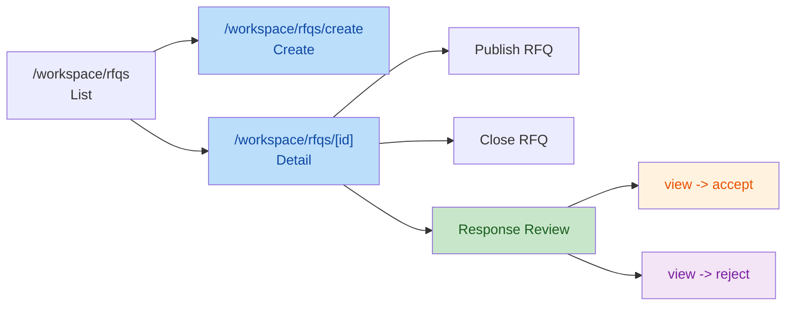
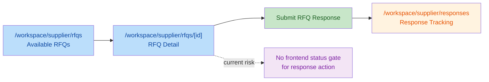

# 408 M14.6.2.2 RFQ Domain Flow Completeness Validation Report

## Execution Context

- Task ID: `408_M14.6.2.2_RFQ_Domain_Flow_Completeness_Validation`
- Task Mode: `ONLY READ FRONTEND DOMAIN VALIDATION`
- Repository Root: `F:\Desktop\VISNDT`
- Code Root: `F:\Desktop\VISNDT\VISNDT`
- Branch: `main`
- Validation Type: `Frontend Domain Read-Only Audit`

Pre-check result:

- Repository Root matches expected path
- Code Root matches expected path
- Branch matches expected value `main`

Read-before-audit reports:

- [406_M14.6.2.0_Domain_Workflow_Boundary_Review_Report.md](file:///F:/Desktop/VISNDT/docs/_review/406_M14.6.2.0_Domain_Workflow_Boundary_Review_Report.md)
- [407_M14.6.2.1_Buyer_RFQ_Response_Decision_Domain_Flow_Implementation_Report.md](file:///F:/Desktop/VISNDT/docs/_review/407_M14.6.2.1_Buyer_RFQ_Response_Decision_Domain_Flow_Implementation_Report.md)

Audit constraint:

- Only audited frontend domain files explicitly requested by the task
- No code/API/database modification performed

## Audit Scope

Audited files:

- [apps/web/src/app/workspace/rfqs/page.tsx](file:///F:/Desktop/VISNDT/VISNDT/apps/web/src/app/workspace/rfqs/page.tsx#L1-L147)
- [apps/web/src/app/workspace/rfqs/create/page.tsx](file:///F:/Desktop/VISNDT/VISNDT/apps/web/src/app/workspace/rfqs/create/page.tsx#L1-L224)
- [apps/web/src/app/workspace/rfqs/[id]/page.tsx](file:///F:/Desktop/VISNDT/VISNDT/apps/web/src/app/workspace/rfqs/%5Bid%5D/page.tsx#L1-L369)
- [apps/web/src/app/workspace/supplier/rfqs/page.tsx](file:///F:/Desktop/VISNDT/VISNDT/apps/web/src/app/workspace/supplier/rfqs/page.tsx#L1-L160)
- [apps/web/src/app/workspace/supplier/rfqs/[id]/page.tsx](file:///F:/Desktop/VISNDT/VISNDT/apps/web/src/app/workspace/supplier/rfqs/%5Bid%5D/page.tsx#L1-L529)
- [apps/web/src/app/workspace/supplier/responses/page.tsx](file:///F:/Desktop/VISNDT/VISNDT/apps/web/src/app/workspace/supplier/responses/page.tsx#L1-L184)
- [apps/web/src/services/rfq.service.ts](file:///F:/Desktop/VISNDT/VISNDT/apps/web/src/services/rfq.service.ts#L1-L99)

Out of scope:

- Backend controllers/services
- Database / Prisma schema
- API contract changes
- Non-requested frontend files

## Buyer RFQ Lifecycle Check

Buyer RFQ lifecycle overview:

Evidence:

1. Buyer RFQ list page exists and exposes create entry.
   - Create entry button: [rfqs/page.tsx:L53-L65](file:///F:/Desktop/VISNDT/VISNDT/apps/web/src/app/workspace/rfqs/page.tsx#L53-L65)
   - List data loads through service layer: [rfqs/page.tsx:L26-L42](file:///F:/Desktop/VISNDT/VISNDT/apps/web/src/app/workspace/rfqs/page.tsx#L26-L42)

2. Buyer RFQ create page exists and can submit create action.
   - Demand selection + mutation setup: [rfqs/create/page.tsx:L32-L58](file:///F:/Desktop/VISNDT/VISNDT/apps/web/src/app/workspace/rfqs/create/page.tsx#L32-L58)
   - Submit button and flow: [rfqs/create/page.tsx:L176-L217](file:///F:/Desktop/VISNDT/VISNDT/apps/web/src/app/workspace/rfqs/create/page.tsx#L176-L217)

3. Buyer RFQ detail page exposes publish and close actions with state-based availability.
   - Publish / close handlers: [rfqs/%5Bid%5D/page.tsx:L121-L143](file:///F:/Desktop/VISNDT/VISNDT/apps/web/src/app/workspace/rfqs/%5Bid%5D/page.tsx#L121-L143)
   - State guards: [rfqs/%5Bid%5D/page.tsx:L145-L147](file:///F:/Desktop/VISNDT/VISNDT/apps/web/src/app/workspace/rfqs/%5Bid%5D/page.tsx#L145-L147)
   - Action buttons rendering: [rfqs/%5Bid%5D/page.tsx:L209-L229](file:///F:/Desktop/VISNDT/VISNDT/apps/web/src/app/workspace/rfqs/%5Bid%5D/page.tsx#L209-L229)

4. Buyer response decision chain requested by 406 is now present in frontend domain page.
   - Decision handlers call `view`, then `accept` / `reject` when needed: [rfqs/%5Bid%5D/page.tsx:L154-L179](file:///F:/Desktop/VISNDT/VISNDT/apps/web/src/app/workspace/rfqs/%5Bid%5D/page.tsx#L154-L179)
   - Response review UI and buttons: [rfqs/%5Bid%5D/page.tsx:L232-L345](file:///F:/Desktop/VISNDT/VISNDT/apps/web/src/app/workspace/rfqs/%5Bid%5D/page.tsx#L232-L345)
   - Service layer exposes `viewRfqResponse`, `acceptRfqResponse`, `rejectRfqResponse`: [rfq.service.ts:L81-L99](file:///F:/Desktop/VISNDT/VISNDT/apps/web/src/services/rfq.service.ts#L81-L99)

Assessment:

- Buyer RFQ domain lifecycle is materially complete in the audited frontend domain scope.
- The 406 report's primary frontend gap, Buyer Response Decision, is closed by current code fact.

## Supplier Response Lifecycle Check

Supplier response lifecycle overview:

Evidence:

1. Supplier RFQ list page exists and loads available RFQs from service layer.
   - Service-based load: [supplier/rfqs/page.tsx:L37-L55](file:///F:/Desktop/VISNDT/VISNDT/apps/web/src/app/workspace/supplier/rfqs/page.tsx#L37-L55)
   - Detail entry link: [supplier/rfqs/page.tsx:L126-L132](file:///F:/Desktop/VISNDT/VISNDT/apps/web/src/app/workspace/supplier/rfqs/page.tsx#L126-L132)

2. Supplier RFQ detail page exists and supports response submission.
   - RFQ detail load: [supplier/rfqs/%5Bid%5D/page.tsx:L101-L118](file:///F:/Desktop/VISNDT/VISNDT/apps/web/src/app/workspace/supplier/rfqs/%5Bid%5D/page.tsx#L101-L118)
   - Submit handler: [supplier/rfqs/%5Bid%5D/page.tsx:L120-L144](file:///F:/Desktop/VISNDT/VISNDT/apps/web/src/app/workspace/supplier/rfqs/%5Bid%5D/page.tsx#L120-L144)
   - Response form rendering: [supplier/rfqs/%5Bid%5D/page.tsx:L347-L505](file:///F:/Desktop/VISNDT/VISNDT/apps/web/src/app/workspace/supplier/rfqs/%5Bid%5D/page.tsx#L347-L505)
   - Service layer exposes `createRfqResponse`: [rfq.service.ts:L74-L79](file:///F:/Desktop/VISNDT/VISNDT/apps/web/src/services/rfq.service.ts#L74-L79)

3. Supplier response tracking page exists.
   - Response list load: [supplier/responses/page.tsx:L52-L70](file:///F:/Desktop/VISNDT/VISNDT/apps/web/src/app/workspace/supplier/responses/page.tsx#L52-L70)
   - Response records rendering: [supplier/responses/page.tsx:L107-L166](file:///F:/Desktop/VISNDT/VISNDT/apps/web/src/app/workspace/supplier/responses/page.tsx#L107-L166)

Assessment:

- Supplier can complete the primary frontend chain `available RFQ -> response submit -> response tracking`.
- Lifecycle expression is not fully tightened at page level because response action visibility is not restricted by RFQ status in the frontend.

## Missing Domain Actions

High-confidence findings were re-validated by two independent code-check passes before being written into this report.

1. No missing Buyer decision action remains inside the audited frontend RFQ detail page.
   - Buyer review / accept / reject actions are present: [rfqs/%5Bid%5D/page.tsx:L232-L345](file:///F:/Desktop/VISNDT/VISNDT/apps/web/src/app/workspace/rfqs/%5Bid%5D/page.tsx#L232-L345)

2. Buyer RFQ create action exists, but its service-layer expression is incomplete.
   - Page directly imports `createRfq` from API wrapper instead of `rfq.service`: [rfqs/create/page.tsx:L10-L12](file:///F:/Desktop/VISNDT/VISNDT/apps/web/src/app/workspace/rfqs/create/page.tsx#L10-L12)
   - Create mutation directly calls API wrapper: [rfqs/create/page.tsx:L43-L48](file:///F:/Desktop/VISNDT/VISNDT/apps/web/src/app/workspace/rfqs/create/page.tsx#L43-L48)
   - `rfq.service.ts` does not expose `createRfq`: [rfq.service.ts:L4-L17](file:///F:/Desktop/VISNDT/VISNDT/apps/web/src/services/rfq.service.ts#L4-L17), [rfq.service.ts:L27-L99](file:///F:/Desktop/VISNDT/VISNDT/apps/web/src/services/rfq.service.ts#L27-L99)
   - Impact: lifecycle action exists, but the page does not fully follow the project service-boundary convention.

3. Supplier response action is missing frontend lifecycle gating.
   - Response entry button always renders when `rfq` exists: [supplier/rfqs/%5Bid%5D/page.tsx:L183-L210](file:///F:/Desktop/VISNDT/VISNDT/apps/web/src/app/workspace/supplier/rfqs/%5Bid%5D/page.tsx#L183-L210)
   - Response form always renders when `rfq` exists: [supplier/rfqs/%5Bid%5D/page.tsx:L347-L505](file:///F:/Desktop/VISNDT/VISNDT/apps/web/src/app/workspace/supplier/rfqs/%5Bid%5D/page.tsx#L347-L505)
   - Submit handler does not pre-check `rfq.status`: [supplier/rfqs/%5Bid%5D/page.tsx:L120-L144](file:///F:/Desktop/VISNDT/VISNDT/apps/web/src/app/workspace/supplier/rfqs/%5Bid%5D/page.tsx#L120-L144)
   - Impact: non-open RFQ states still expose a submit attempt path in UI and rely on backend rejection messaging.

## Boundary Check

Boundary observations:

1. Buyer RFQ detail page correctly places business mutations inside frontend domain page and routes them through `rfq.service`.
   - Imports from service layer: [rfqs/%5Bid%5D/page.tsx:L11-L19](file:///F:/Desktop/VISNDT/VISNDT/apps/web/src/app/workspace/rfqs/%5Bid%5D/page.tsx#L11-L19)

2. Supplier RFQ list/detail/response pages also use `rfq.service` for requested domain actions.
   - Supplier list import: [supplier/rfqs/page.tsx:L14-L15](file:///F:/Desktop/VISNDT/VISNDT/apps/web/src/app/workspace/supplier/rfqs/page.tsx#L14-L15)
   - Supplier detail import: [supplier/rfqs/%5Bid%5D/page.tsx:L13-L14](file:///F:/Desktop/VISNDT/VISNDT/apps/web/src/app/workspace/supplier/rfqs/%5Bid%5D/page.tsx#L13-L14)
   - Supplier response list import: [supplier/responses/page.tsx:L13-L14](file:///F:/Desktop/VISNDT/VISNDT/apps/web/src/app/workspace/supplier/responses/page.tsx#L13-L14)

3. Boundary exception remains in Buyer create page.
   - Direct API import bypassing service layer: [rfqs/create/page.tsx:L10-L12](file:///F:/Desktop/VISNDT/VISNDT/apps/web/src/app/workspace/rfqs/create/page.tsx#L10-L12)

Boundary judgment:

- `PASS WITH RISKS`
- No dashboard mutation was audited or modified in this task.
- Within the requested scope, business mutations remain in domain pages, but Buyer create flow is not fully normalized to `page -> service -> api wrapper`.

## Freeze Check

- Code Modified: `No`
- API Modified: `No`
- Database Modified: `No`
- Prisma Schema Modified: `No`
- New Feature Added: `No`
- Validation Output Added: `Yes`

Generated report:

- [408_M14.6.2.2_RFQ_Domain_Flow_Completeness_Validation_Report.md](file:///F:/Desktop/VISNDT/docs/_review/408_M14.6.2.2_RFQ_Domain_Flow_Completeness_Validation_Report.md)

## Final Status

`PASS WITH RISKS`

Conclusion:

- Buyer RFQ lifecycle is now complete at frontend domain page level, including response review and decision flow.
- Supplier primary response lifecycle is present, but frontend action gating is still weaker than the intended domain-state expression.
- Service-layer normalization is incomplete for Buyer RFQ create flow.
