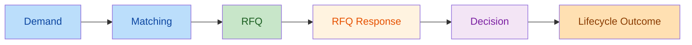
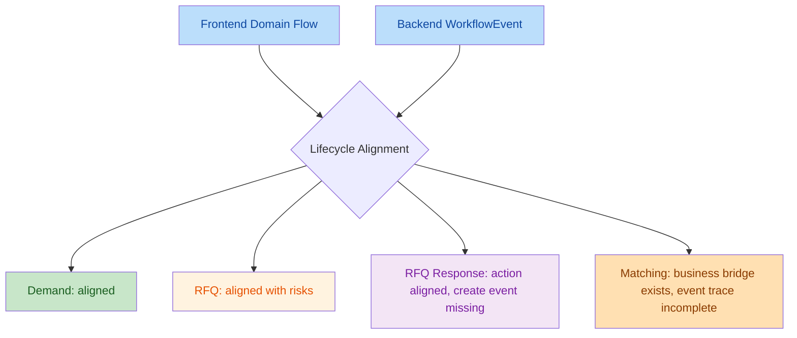

# 411_M14.6.3.2 Workflow Lifecycle Boundary Review Report

## 1. Execution Context

- Task ID: `411_M14.6.3.2_Workflow_Lifecycle_Boundary_Review`
- Task Mode: `ONLY READ ARCHITECTURE REVIEW`
- Repository Root: `F:\Desktop\VISNDT`
- Code Root: `F:\Desktop\VISNDT\VISNDT`
- Branch: `main`
- Execution Date: `2026-08-11`

Pre-check result:

- Repository Root matches expected path.
- Code Root matches expected path.
- Branch matches expected value `main`.

Read-only constraint:

- No code modification performed.
- No API/database/schema/migration modification performed.
- This task only reads prior review artifacts and outputs this report.

## 2. Audit Scope

Reviewed documents:

- [406_M14.6.2.0_Domain_Workflow_Boundary_Review_Report.md](file:///F:/Desktop/VISNDT/docs/_review/406_M14.6.2.0_Domain_Workflow_Boundary_Review_Report.md)
- [407_M14.6.2.1_Buyer_RFQ_Response_Decision_Domain_Flow_Implementation_Report.md](file:///F:/Desktop/VISNDT/docs/_review/407_M14.6.2.1_Buyer_RFQ_Response_Decision_Domain_Flow_Implementation_Report.md)
- [408_M14.6.2.2_RFQ_Domain_Flow_Completeness_Validation_Report.md](file:///F:/Desktop/VISNDT/docs/_review/408_M14.6.2.2_RFQ_Domain_Flow_Completeness_Validation_Report.md)
- [409_M14.6.3.0_Workflow_Event_Consistency_Audit_Report.md](file:///F:/Desktop/VISNDT/docs/_review/409_M14.6.3.0_Workflow_Event_Consistency_Audit_Report.md)
- [410_M14.6.3.1_Technical_Debt_Registry_Establishment_Report.md](file:///F:/Desktop/VISNDT/docs/_review/410_M14.6.3.1_Technical_Debt_Registry_Establishment_Report.md)
- [M15_TECHNICAL_DEBT_REGISTRY起点债.md](file:///F:/Desktop/VISNDT/docs/_review/M15_TECHNICAL_DEBT_REGISTRY%E8%B5%B7%E7%82%B9%E5%80%BA.md)

Audit method:

- Reconstruct lifecycle from prior architecture / implementation / validation reports.
- Compare frontend domain action coverage with backend workflow coverage.
- Identify boundary gaps that are currently only suitable for registry suggestion, not immediate code change.

## 3. Lifecycle Map

Overall lifecycle judgment: `Closed with residual risks`

Lifecycle interpretation based on reviewed reports:

- `Demand -> Matching` chain is established in [406](file:///F:/Desktop/VISNDT/docs/_review/406_M14.6.2.0_Domain_Workflow_Boundary_Review_Report.md).
- `RFQ -> RFQ Response -> Decision` frontend chain was materially closed by [407](file:///F:/Desktop/VISNDT/docs/_review/407_M14.6.2.1_Buyer_RFQ_Response_Decision_Domain_Flow_Implementation_Report.md) and revalidated by [408](file:///F:/Desktop/VISNDT/docs/_review/408_M14.6.2.2_RFQ_Domain_Flow_Completeness_Validation_Report.md).
- Backend WorkflowEvent trace is not fully closed according to [409](file:///F:/Desktop/VISNDT/docs/_review/409_M14.6.3.0_Workflow_Event_Consistency_Audit_Report.md).

## 4. Frontend / Backend Alignment Review

Alignment review:

1. Demand
   - Frontend domain flow for create/edit/publish/close was already evidenced in `406`.
   - Backend lifecycle and WorkflowEvent coverage for Demand core stages are materially aligned.

2. Matching
   - Matching exists as the bridge after Demand publish in `406`.
   - Business bridge exists, but backend event trace is incomplete because `MATCH_CREATED` is missing in `409`.

3. RFQ
   - Buyer create/publish/close and supplier view/respond are evidenced in `406` and `408`.
   - RFQ frontend lifecycle is usable, but create boundary and legacy create path remain governance risks.

4. RFQ Response / Decision
   - Buyer decision flow is no longer a frontend gap after `407`, and `408` confirms closure of the main decision route.
   - Backend decision events exist, but `RFQResponse CREATE` still lacks WorkflowEvent according to `409`.

Overall alignment judgment:

- Frontend Domain Flow: `PASS WITH RISKS`
- Backend WorkflowEvent Alignment: `PASS WITH RISKS`

## 5. Missing Boundary List

Confirmed missing or weak boundaries:

1. Supplier RFQ Response frontend state gate is still weak.
   - `408` confirms the supplier response path exists, but page-level action visibility still relies mainly on backend validation instead of explicit RFQ status boundary expression.

2. Matching creation is not fully reflected in backend lifecycle events.
   - `409` confirms `MATCH_CREATED` WorkflowEvent is missing, weakening the lifecycle bridge trace from Demand to downstream RFQ activities.

3. Match event subject is not canonical.
   - `409` confirms match-related status changes are not consistently recorded under a single entity subject model.

4. Generic lifecycle mutation surfaces remain a boundary risk.
   - `406` and `409` both retain the finding that broad update paths for Demand / RFQ status are wider than ideal lifecycle boundaries.

## 6. Technical Debt Candidate List

This section records suggestions only. No registry file was modified in this task.

1. Candidate: `Supplier RFQ Response Frontend State Gate`
   - Type: `PASS WITH RISKS / Technical Debt`
   - Source: `408_M14.6.2.2`
   - Suggestion: register as a dedicated TD item in the M15 registry.

2. Candidate: `MATCH_CREATED WorkflowEvent Coverage`
   - Type: `Technical Debt`
   - Source: `409_M14.6.3.0`
   - Suggestion: either split from current `TD-002` or explicitly expand `TD-002` scope.

3. Candidate: `Match Entity Subject Canonicalization`
   - Type: `PASS WITH RISKS / Architecture Debt`
   - Source: `409_M14.6.3.0`
   - Suggestion: track separately if the team wants finer-grained lifecycle audit governance.

4. Candidate: `Generic Demand/RFQ Status Mutation Boundary`
   - Type: `DEFERRED / Architecture Debt`
   - Source: `406_M14.6.2.0`, `409_M14.6.3.0`
   - Suggestion: register or attach explicitly to a future API hardening task.

Registry observation:

- Current registry established by [410](file:///F:/Desktop/VISNDT/docs/_review/410_M14.6.3.1_Technical_Debt_Registry_Establishment_Report.md) contains only `TD-001` and `TD-002`.
- Based on this review, the registry is usable as a governance start point, but it does not yet enumerate all currently visible lifecycle-boundary debt candidates.

## 7. Architecture Impact

- No runtime architecture was changed in this task.
- The current business lifecycle is largely usable and mainly closed at domain-flow level.
- The remaining impact is governance and auditability rather than immediate feature unavailability.
- The strongest residual concern is that lifecycle traceability is weaker than lifecycle implementation completeness.

## 8. Freeze Check

- Code Modified: `No`
- API Modified: `No`
- Database Modified: `No`
- Schema Modified: `No`
- Migration Modified: `No`

## 9. Final Status

`PASS WITH RISKS`

Final conclusion:

- `Demand -> Matching -> RFQ -> RFQ Response -> Decision` main business lifecycle is materially closed based on the reviewed reports.
- Frontend domain actions cover the main user-visible lifecycle, including Buyer decision flow after task `407`.
- Backend WorkflowEvent coverage still does not fully match lifecycle reality.
- Current unresolved items should be treated as registry candidates and follow-up governance work, not as blockers for this read-only review task.
